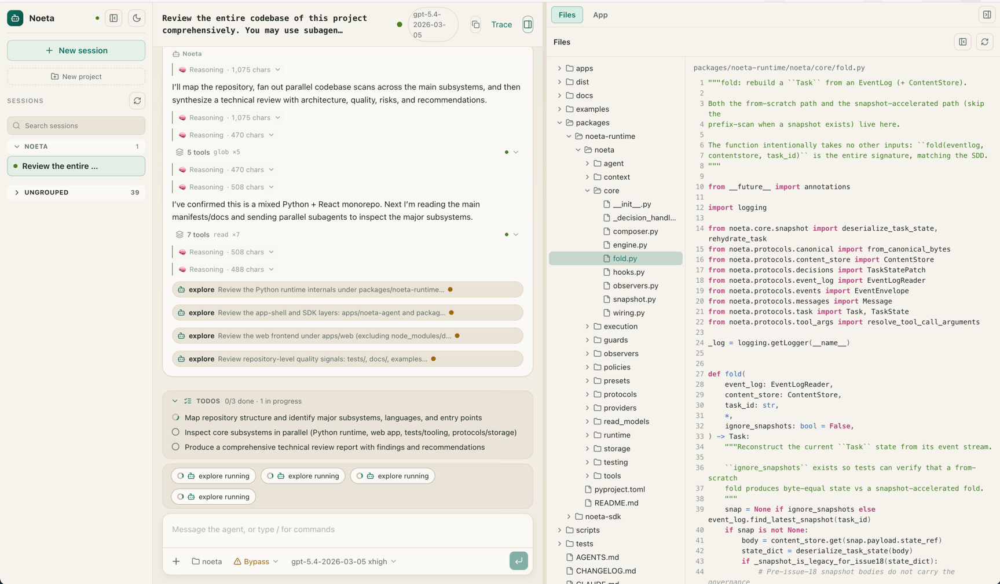

# Noeta

**English** · [简体中文](README.zh-CN.md)

> A single-host, durable, event-sourced runtime for AI agents.

Noeta hosts, records, and schedules agent execution — without prescribing how
the agent is written. Every step an agent takes lands in an append-only
**EventLog**, and a task's entire state is *folded* back from that log. Suspend
and resume, crash recovery, replay, and exactly-once wake are not features
bolted on top; they fall out of treating the log as the single source of truth.

Where an in-process agent library (claude-agent-sdk, LangChain) gives you the
loop, Noeta adds the durable substrate underneath it — so an agent's history is
a log you can fold, inspect, and re-enter, not ephemeral memory that dies with
the process.

<p align="center">
  
  <br>
  <em>The bundled coding-agent web app, served by <code>python -m noeta.agent</code>.</em>
</p>

## Why Noeta

- **Durable by construction** — every state change is an appended event; task
  state is deterministically folded from the log, never held across runs. Kill
  the process mid-task and fold brings it right back.
- **Provider-neutral** — Anthropic and OpenAI-compatible endpoints are adapters
  behind one internal protocol. Swapping providers is wiring, not a rewrite; no
  vendor's shape leaks into the core.
- **Bring your own agent** — the runtime hosts and schedules; you supply the
  policy, tools, and context. A ReAct policy and a coding agent ship in-tree,
  but nothing forces you to use them.
- **Offline-first** — a deterministic `stub` provider runs the whole stack with
  no API key and no network, so install, storage, and wiring are provable on a
  fresh checkout (and in CI).
- **Use the layer you need** — embed the kernel, import the SDK, or run the
  batteries-included coding agent with its bundled web UI.

## Quickstart (no API key)

The `stub` provider is a deterministic two-turn LLM double — no key, no network.
Use it to prove install + storage + engine wiring end-to-end.

```bash
# Installs the coding agent, which pulls the SDK + runtime transitively.
pip install noeta-agent
python -m noeta.agent   # boots the offline stub coding agent + bundled web
```

### One command (Makefile)

The repo-root `Makefile` chains "build the web app" and "boot the backend" so
you don't have to. The entry point is still `python -m noeta.agent`; the
Makefile only builds the frontend and maps a few convenience knobs onto the
existing `NOETA_AGENT_*` environment variables.

```bash
make install   # first time: editable install + web deps
make run        # build web + boot backend (offline stub, port 8765)
#  → open http://127.0.0.1:8765/chat

make run PORT=9000   # override a knob; `make dev` runs the vite hot-reload pair
```

### Use a real model

Copy the template, add your key, and `make run` picks it up automatically. Your
key lives in a gitignored file and is never committed.

```bash
cp noeta.config.example.json noeta.config.json
make run                                              # reads ./noeta.config.json
make run CONFIG=examples/openai-compatible/config.json   # or any JSON config
```

### The boot as a Python program

The same startup is a short program — build the offline backend, prove it
serves, shut it down:

<!-- runnable: smoke -->
```python
from noeta.agent.backend.lifecycle import BackendConfig, serve_backend

# Defaults are fully offline: the two-turn stub provider, :memory: storage.
# port=0 binds an OS-assigned port. Workspace is the current directory.
config = BackendConfig(port=0)
server, url, shutdown = serve_backend(config)
try:
    assert url.startswith("http://")
finally:
    shutdown()
```

The backend binds an ephemeral port and serves the bundled web app in under a
second.

## The three distributions

Noeta ships as two libraries plus one app shell. Install the top one you need —
each pulls the layers below it.

| Distribution | Location | What it is |
| --- | --- | --- |
| **`noeta-runtime`** | `packages/noeta-runtime` | The engine: the event-sourced kernel (Engine, fold, snapshot, Worker/Dispatcher, storage, guards, observers) **plus** the agent materials that run on it — the ReAct policy, fs/shell/mcp tools, the Anthropic + OpenAI-compat providers, the context composer + skills, and the official preset agents. Everything to run an agent in-process. |
| **`noeta-sdk`** | `packages/noeta-sdk` | A thin in-process client surface over the engine: `import noeta.sdk`, then `query` / `Client` / `Options` / `tool`. No engine internals, no HTTP. Comparable to claude-agent-sdk / LangChain. |
| **`noeta-agent`** | `apps/noeta-agent` | The official workspace-scoped **coding-agent app**, built on the SDK: an HTTP/SSE backend, the bundled web app (`apps/web`), slash commands, and built-in skills. `python -m noeta.agent` is the only entry point. |

There is no `noeta` console script — the coding agent and its web UI launch with
`python -m noeta.agent`.

## Build your own agent (the SDK)

Don't want the bundled coding agent? Import `noeta.sdk` and drive your own —
define tools, point it at a workspace, run a model, and read back the durable
event stream. No app shell, no HTTP. Like claude-agent-sdk / LangChain, except
every turn lands in the same foldable EventLog the runtime is built on.

```python
from pathlib import Path

from noeta.sdk import query, Options, tool, ToolContext, ToolResult
from noeta.sdk.providers import AnthropicProvider

# A tool is a function returning a ToolResult. `version` is part of the tool's
# identity, so it is mandatory.
@tool(name="word_count", version="1", risk_level="low", input_schema={
    "type": "object",
    "properties": {"text": {"type": "string"}},
    "required": ["text"],
})
def word_count(arguments: dict, ctx: ToolContext) -> ToolResult:
    n = len(str(arguments["text"]).split())
    return ToolResult(success=True, output=f"{n} words")

options = Options(
    system_prompt="You are a concise assistant.",
    name="main",
    allowed_tools=("read", word_count),   # built-ins by name, custom tools by value
    permission_mode="bypassPermissions",
)

# query() drives one turn and returns the full event-envelope stream — the
# machine-readable record of everything the agent did.
for env in query(
    options,
    goal="How many words are in 'the quick brown fox'?",
    provider=AnthropicProvider(api_key="sk-ant-...", default_max_tokens=1024),
    workspace_dir=Path("."),
    model="claude-sonnet-4-5",   # any model id your provider serves
):
    print(env.type)
```

For a multi-turn session reach for `Client` instead of `query` (`client.start(...)`,
then `client.messages(task_id)` for a human-readable projection). It all runs
**offline with no API key** too — swap the provider for the scripted
`FakeLLMProvider` from `noeta.testing`. Runnable end-to-end examples:

- [`examples/sdk_minimal.py`](examples/sdk_minimal.py) — the pure-SDK path, offline
- [`examples/custom_tool.py`](examples/custom_tool.py) — a custom `@tool`
- [`examples/swap_provider.py`](examples/swap_provider.py) — Anthropic ↔ OpenAI-compatible
- [`examples/spawn_subtask.py`](examples/spawn_subtask.py) — delegate to a sub-agent

## Noeta vs the Claude Agent SDK — a server-side view

Both give you an agent loop, tools, MCP, and sub-agents. They differ in the
**spine underneath**, and that difference matters most when the agent runs
server-side — long-lived, restart-surviving, audited. The Claude Agent SDK is a
light in-process client that drives a well-hosted agent; Noeta is a durable,
self-hosted execution substrate you own. (Anthropic's *fully hosted* server-side
option is a different product — Managed Agents — where Anthropic runs the loop
and the sandbox; that trades ownership of the substrate for zero ops.)

| Server-side concern | Claude Agent SDK | Noeta |
| --- | --- | --- |
| Who owns the execution substrate | You host the loop; state lives in the client process | You host it; the loop, log, and scheduler run in **your** infrastructure |
| State / recovery | Session JSONL (a conversation recording); resume replays the conversation | `state = fold(events)`; crash recovery is a refold — no separate load path |
| Suspend / resume / exactly-once wake | Resume / fork by session id | First-class: durable wake survives a worker crash (single-host today) |
| Compaction | Auto-summary, irreversible (archive it yourself via a PreCompact hook) | A recorded, replayable event; original history is never scrubbed |
| Provider | Configures multiple backends, but the shape is Anthropic-centric | Vendor-neutral internal protocol; the kernel can't depend on any vendor |
| Scheduling / distribution | A single in-process query / client | A lease + durable-log queue substrate (ships single-host / single-worker) |

**When each wins.** Reach for the **Claude Agent SDK** when you want it working
out of the box and tracking official Claude capabilities closely — the ops
burden and the ecosystem are Anthropic's. Reach for **Noeta** when you want the
agent's execution to be a reproducible, auditable, vendor-neutral **ledger you
own and can replay** — the price is that you run and operate the substrate
yourself.

**Honest server-side caveats (Noeta).** It is pre-1.0 and ships **single-host /
single-worker** — a production fleet needs multi-host, which today means
swapping the storage adapter and standing up a worker pool (the engine doesn't
change, but that work isn't shipped). The ecosystem is smaller and there are
fewer built-in integrations, so you maintain more yourself, and there is no
managed hosting or vendor SLA.

## Documentation

- [`docs/quickstart.md`](docs/quickstart.md) — the offline smoke plus a real-provider walkthrough
- [`docs/concepts.md`](docs/concepts.md) — the core model: Task / EventLog / Dispatcher / Engine / Guard / Observer / Policy / Composer
- [`docs/noeta-agent.md`](docs/noeta-agent.md) — the `python -m noeta.agent` coding agent: tools, presets, skills, write/shell policy, HTTP surface, MCP / hooks
- [`docs/noeta-architecture-deep-dive.md`](docs/noeta-architecture-deep-dive.md) — top-down architecture, with Claude Agent SDK comparisons
- [`docs/failure-modes.md`](docs/failure-modes.md) — missing API key, budget exhaustion, durable exactly-once wake recovery
- [`docs/adr/`](docs/adr/) — Architecture Decision Records: *why* each cross-module decision is the way it is (audience: anyone about to change the code). Vocabulary lives in [`CONTEXT.md`](CONTEXT.md).

For SDK usage — minimal agent, custom tool, swapping providers, delegating to a
sub-agent — see [`examples/`](examples/).

## Installation

Noeta is on PyPI. The distributions chain by dependency (`noeta-agent` →
`noeta-sdk` → `noeta-runtime`), so installing the top package pulls the rest.
Requires Python 3.11 or newer.

```bash
# Default coding-agent experience (pulls noeta-sdk + noeta-runtime)
pip install noeta-agent

# SDK only — author + host your own agent (pulls noeta-runtime)
pip install noeta-sdk

# Kernel only — embed the runtime
pip install noeta-runtime
```

For development, install editable from a checkout instead — each `-e` package
pulls its workspace siblings:

```bash
uv pip install -e apps/noeta-agent   # or packages/noeta-sdk, packages/noeta-runtime

# Direct from git, no checkout
pip install "noeta-agent @ git+https://github.com/initxy/noeta.git#subdirectory=apps/noeta-agent"
```

## Repository layout

All distributions contribute subpackages to a shared PEP 420 `noeta.` namespace
(there is no top-level `noeta/__init__.py`).

```
packages/
  noeta-runtime/     # engine = kernel (mechanism) + agent materials
    noeta/
      protocols/    # dataclasses + Protocol types — the only typed boundary
      core/         # Engine / fold / snapshot / HookManager
      runtime/      # Worker / Dispatcher / ToolRuntime / RuntimeLLMClient / Compaction
      storage/      # InMemory + Sqlite adapters
      guards/       # BudgetGuard / PermissionGuard
      observers/    # Audit / Metrics / SSE fanout
      read_models/  # read-only projections
      policies/     # ReActPolicy / stub policies
      tools/        # fs / shell / mcp / fake
      providers/    # Anthropic + OpenAI-compat adapters
      context/      # ThreeSegmentComposer / skill registry
      execution/    # generic driver / runner / resolver / builder
      agent/        # AgentSpec / AgentRegistry / deterministic fingerprint
      presets/      # official 4-agent set: main / explore / plan / general-purpose
      testing/      # in-repo test doubles / harness helpers
  noeta-sdk/         # thin in-process client surface (no engine internals, no HTTP)
    noeta/
      sdk/          # public facade: query / Client / Options / tool / extension interfaces
      client/       # HostConfig / Options compilation over the engine
apps/
  noeta-agent/        # official coding-agent app shell
    noeta/
      agent/         # backend (HTTP/SSE) / host builder / commands / __main__ / built-in skills
                     #   wheel force-includes apps/web at noeta/agent/static
  web/               # standalone coding SPA (HTTP/SSE client only)
tests/              # pytest suite (repo root)
docs/               # user-facing documentation
docs/adr/           # architecture decision records
examples/           # SDK usage examples (+ _internal/ kernel demos)
scripts/            # lint scripts (naming + engine line-budget)
```

## Development

```bash
uv sync
uv run pytest
uv run lint-imports --config .importlinter
uv run python scripts/lint-naming.py
```

Contributing (human or agent) starts at the root [`AGENTS.md`](AGENTS.md)
router; [`CONTRIBUTING.md`](CONTRIBUTING.md) points you there and at the working
conventions.

## Status & scope

Noeta is an early, pre-1.0 preview. It runs, it is tested, and the core is
stable, but some capabilities are intentionally out of scope for now:

- **Single-host only.** The shipped worker drains the dispatcher in-process and
  is a preview, not a production daemon. Multi-host coordination is not
  addressed.
- **Durable wake is single-host / single-worker.** Single-worker durable
  exactly-once wake is shipped; multi-worker concurrency + fencing, and the
  partial-step-orphan edge (a crash mid-step), remain limitations — see
  [`docs/failure-modes.md`](docs/failure-modes.md).
- **Human-in-the-loop / timer wake** — the engine carries the shape; the full
  UX is still landing.
- **Frontend** — the shipped web app is a small Vite MPA with vanilla ES
  modules; no framework migration is planned for the preview.

## License

Apache License 2.0 — see [`LICENSE`](LICENSE).
