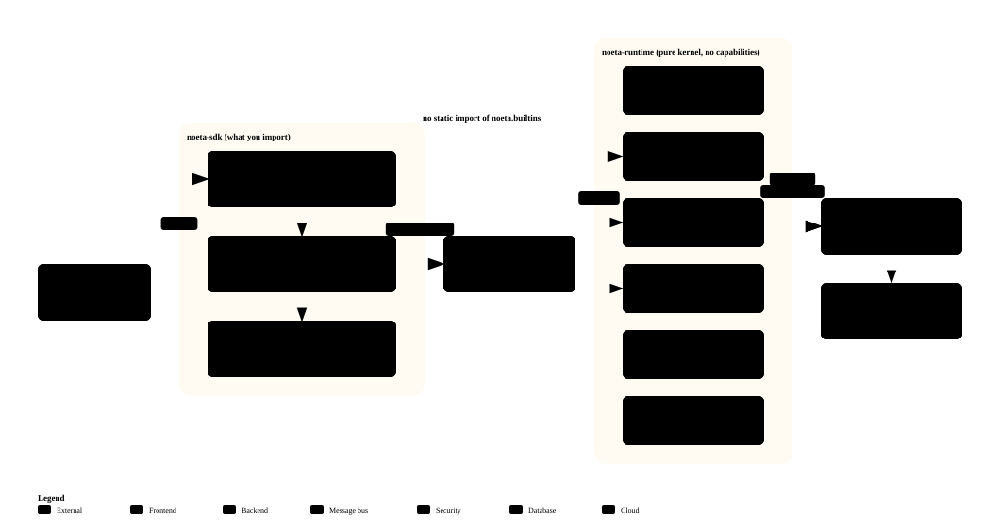

<div align="center">
  <picture>
    <source media="(prefers-color-scheme: dark)" srcset="docs/assets/logo/noeta-logo-dark.svg">
    
  </picture>
  <p>
    <a href="https://pypi.org/project/noeta-sdk/"></a>
    <a href="https://github.com/initxy/noeta/actions/workflows/ci.yml"></a>
    <a href="https://pypi.org/project/noeta-sdk/"></a>
    <a href="LICENSE"></a>
  </p>
</div>

**A Python runtime and SDK where an agent's entire run is a replayable event ledger.** Noeta hosts long-horizon agents inside your own process — no server, no HTTP hop — and records every model round-trip, tool call, and approval as an event. State is never held in memory; it is `fold(events)`, recomputed from the log. Kill the process mid-task and another worker resumes exactly where it stopped, exactly once. The kernel is structurally forbidden from importing a vendor SDK, so Anthropic, OpenAI-compatible, and Responses models are one line of wiring apart.

**English** · [简体中文](README.zh-CN.md) · [Docs](https://initxy.github.io/noeta/) · [Quickstart](https://initxy.github.io/noeta/tutorials/quickstart/) · [First agent](https://initxy.github.io/noeta/tutorials/first-agent/) · [SDK reference](https://initxy.github.io/noeta/reference/sdk/)

## 60-second quickstart

```bash
uv pip install noeta-sdk      # noeta-runtime comes along as a transitive dep
```

Python 3.11+. Now drive a full turn with no API key and no network — the offline `FakeLLMProvider` stands in for a model:

<!-- runnable: smoke -->
```python
from noeta.sdk import Options, query, LLMResponse, TextBlock, Usage
from noeta.sdk.testing import FakeLLMProvider

provider = FakeLLMProvider(responses=[
    LLMResponse(stop_reason="end_turn",
                content=[TextBlock(text="Hello from Noeta.")],
                usage=Usage(uncached=1, output=1))
])

result = query(
    Options(system_prompt="You are concise.",
            allowed_tools=("read",),
            permission_mode="bypassPermissions"),
    goal="Say hello.",
    provider=provider,
    model="stub-model",
)
assert result.answer() == "Hello from Noeta."
```

`Options` is the recipe, `query` drives one turn, and the result carries the whole event stream — `result.answer()` just reads the final text off it. This block is executed by the test suite on every run, so it works as printed.

Swap in a real model. The provider is *wiring*, not identity: changing it leaves the agent, its tools, and its recorded history untouched.

```python
from noeta.sdk import Options
from noeta.sdk.providers import AnthropicProvider, OpenAICompatProvider

anthropic = Options(system_prompt="…", provider=AnthropicProvider(default_max_tokens=1024))
openai    = Options(system_prompt="…", provider=OpenAICompatProvider(base_url="https://api.openai.com/v1"))
```

Next step: the [5-minute quickstart](https://initxy.github.io/noeta/tutorials/quickstart/) takes this to multi-turn conversation, durable storage, and a resident worker pool.

## How it works

Three ideas carry the whole design. Everything else — audit, replay, suspend/resume, provider neutrality — falls out of them.

### 1. State is a fold over an event log

<p align="center">
  
</p>

Each task owns one append-only stream of events: the goal it was given, each composed context plan, each model response, each tool call and its result, each suspend and wake. There is no task table the engine reads and writes. When something needs the current state, it folds the stream from the beginning and gets it — the state object is a disposable projection, the log is the master copy. Event payloads stay small (capped at 4 KB); anything bigger, such as a full response body or a large tool output, goes to a content-addressed store and the event carries only a reference. Because folding is the only way state comes into being, "what the agent did" and "what the agent is" can never disagree.

Deeper: [Event sourcing](https://initxy.github.io/noeta/concepts/event-sourcing/) · [Fold & snapshot](https://initxy.github.io/noeta/concepts/fold-and-snapshot/) · [State & writers](https://initxy.github.io/noeta/architecture/state-and-writers/)

### 2. Kill it mid-task, it resumes

<p align="center">
  
</p>

A worker takes a *lease* on a task — a short, heartbeat-renewed exclusive hold — and drives it to the next suspend or terminal state. Every write to the log presents that lease id, so exactly one worker can ever be writing a given task. If the worker dies, its heartbeat stops, the lease expires, and the task returns to the ready queue; the next worker folds the log, seals the interrupted attempt as dead history, and carries on from the last durable point. The same machinery covers deliberate waiting: a task can suspend for a human answer, a timer, or a subtask, costing nothing while it sleeps, and the wake that revives it is durable, single-worker, and delivered exactly once — at-least-once delivery plus idempotent consumption.

Deeper: [Wake & resume](https://initxy.github.io/noeta/concepts/wake-resume/) · [Task model](https://initxy.github.io/noeta/concepts/task-model/) · [Deploy a worker](https://initxy.github.io/noeta/how-to/deploy-worker/)

### 3. Two packages, capabilities as plugins

<p align="center">
  
</p>

Noeta ships as two libraries sharing one `noeta.` namespace. **`noeta-sdk`** is the only thing you import: `query` / `Client` / `Options` / `@tool`, the preset agents, and every official capability. **`noeta-runtime`** is the pure kernel — engine, fold, snapshot, worker, dispatcher, lease, context composer — and it declares no dependencies at all. The kernel carries no capability of its own: the file tools, web tools, memory, browser, MCP, sandbox, storage backends, and every provider adapter are built-in *plugins* that reach the kernel only through the loader's dynamic reference resolution, a rule an import linter enforces on every build. That single boundary is why provider neutrality is structural rather than a promise, and why your plugins ride the exact same path Noeta's own do.

Deeper: [Architecture overview](https://initxy.github.io/noeta/architecture/overview/) · [Two packages](https://initxy.github.io/noeta/architecture/packages/) · [Extension planes](https://initxy.github.io/noeta/architecture/extension-planes/)

## Why Noeta

| | What you get |
|---|---|
| **Crash-safe** | State is `fold(events)`, never held in memory. Kill the process mid-task — the next worker resumes exactly where it stopped, exactly once. |
| **Server-ready** | `Client.start_workers(n)` runs a resident pool; on Postgres several hosts share one database with lease-fenced writes. The engine is stateless, so any worker can advance any task. |
| **Long-horizon** | A task suspends for a human answer, a timer, or a subtask, then wakes durably when the condition fires. Sleeping costs nothing. |
| **Provider-neutral** | Anthropic, OpenAI-compatible, and Responses adapters sit behind one protocol. The kernel cannot import a vendor SDK — the build fails if it tries. |
| **Auditable** | Every model round-trip, tool call, guard verdict, and token count is an event. Compaction is a reversible overlay; the originals stay on the stream. |
| **Extensible** | 16 manifest-declared extension surfaces. Noeta's own built-ins (fs, web, memory, browser, MCP, …) ride the same loader as yours. |

### Noeta vs Claude Agent SDK vs Pi Agent

| | **Noeta** | **Claude Agent SDK** | **Pi Agent** |
|---|---|---|---|
| **Focus** | Durable, server-ready agent runtime | In-process agent loop on Claude | Computer use: mouse, keyboard, screen |
| **Deployment** | Multi-worker pool; multi-host on Postgres | Client library, single process | Desktop process |
| **Persistence** | Event ledger — `state = fold(log)` | The conversation, managed for you | Ephemeral, no durable execution model |
| **Suspend / wake** | First class: human, timer, subtask, external event — exactly-once | Session resume | Not applicable |
| **Model lock-in** | None — swap providers by wiring an adapter | Claude-first | Any LLM (it is a control layer) |
| **Extension** | 16 plugin surfaces + the single-writer rule | Tools, MCP, subagents, hooks | Computer-control primitives |
| **Audit / replay** | Full event log, fold-reproducible | Session transcript | None |

**Reach for Noeta when the agent's *running* must be a ledger you can replay, audit, and scale across workers and hosts** — not just a loop you can call. Longer treatment, including LangGraph and Temporal: [comparison](https://initxy.github.io/noeta/reference/comparison/).

## Extend it

Everything open is either an `Options` field or a plugin contribution. Noeta's own capabilities take the same path.

### Add a tool

```python
from noeta.sdk import tool

@tool
def get_weather(city: str) -> str:
    """Get the current weather for a city."""
    return f"{city}: sunny, 22°C"

opts = Options(system_prompt="…", allowed_tools=("read", get_weather))
```

`allowed_tools` takes tool names and tool objects side by side, so a custom tool joins the built-in set without any registration step.

### Add a plugin

A plugin is a package carrying a static manifest that declares contributions to any of the 16 surfaces. The manifest is inert data — Noeta can list and collision-check a plugin's contributions before importing a line of its code.

| Plane | Surfaces | Enters agent identity? |
|---|---|---|
| **Identity** | `tool`, `agent`, `content_kind`, `prompt_fragment`, `policy`, `control_tool` | Yes |
| **Wiring** | `guard`, `observer`, `provider`, `reminder_provider`, `reminder`, `tool_result_transform`, `session_pack` | No — process-wide |
| **Host** | `mcp_server`, `skills`, `sandbox_provider` | No — host-wired |

```toml
# pyproject.toml — a plugin manifest
[tool.noeta]
name = "my-plugin"
requires-noeta = ">=0.5"

[[tool.noeta.tool]]
name = "get_weather"
ref = "my_plugin.tools:get_weather"
```

Load it into the process, then activate it per agent:

```python
from noeta.sdk import load_plugins, Options

plugins = load_plugins(modules=["my_plugin"])
opts = Options(system_prompt="…", plugins=("my-plugin",))
```

Full manifest shape and every surface: [Write a plugin](https://initxy.github.io/noeta/how-to/write-a-plugin/) · [Plugin surfaces](https://initxy.github.io/noeta/reference/plugin-surfaces/).

## Learn more

Full docs: **[initxy.github.io/noeta](https://initxy.github.io/noeta/)**

**Tutorials** — start here, in order
[Quickstart](https://initxy.github.io/noeta/tutorials/quickstart/) · [Your first agent](https://initxy.github.io/noeta/tutorials/first-agent/) · [CI integration](https://initxy.github.io/noeta/tutorials/ci-integration/)

**How-to** — one task per page
[Configure a provider](https://initxy.github.io/noeta/how-to/configure-provider/) · [Swap providers](https://initxy.github.io/noeta/how-to/swap-providers/) · [Build custom tools](https://initxy.github.io/noeta/how-to/build-custom-tools/) · [Write a plugin](https://initxy.github.io/noeta/how-to/write-a-plugin/) · [Connect MCP](https://initxy.github.io/noeta/how-to/connect-mcp/) · [Spawn subagents](https://initxy.github.io/noeta/how-to/spawn-subagents/) · [Use a sandbox](https://initxy.github.io/noeta/how-to/use-sandbox/) · [Deploy a worker](https://initxy.github.io/noeta/how-to/deploy-worker/) · [Deploy with Docker](https://initxy.github.io/noeta/how-to/docker-deployment/) · [Multi-tenant memory](https://initxy.github.io/noeta/how-to/multi-tenant-memory/)

**Concepts** — why it is built this way
[Overview](https://initxy.github.io/noeta/concepts/) · [Event sourcing](https://initxy.github.io/noeta/concepts/event-sourcing/) · [Fold & snapshot](https://initxy.github.io/noeta/concepts/fold-and-snapshot/) · [Task model](https://initxy.github.io/noeta/concepts/task-model/) · [Engine & execution](https://initxy.github.io/noeta/concepts/engine-execution/) · [Wake & resume](https://initxy.github.io/noeta/concepts/wake-resume/) · [Composer & cache](https://initxy.github.io/noeta/concepts/composer-and-cache/) · [Guard vs observer](https://initxy.github.io/noeta/concepts/guard-observer/) · [Provider neutrality](https://initxy.github.io/noeta/concepts/provider-neutrality/)

**Reference** — exact facts
[SDK](https://initxy.github.io/noeta/reference/sdk/) · [Plugins](https://initxy.github.io/noeta/reference/plugins/) · [Tools](https://initxy.github.io/noeta/reference/tools/) · [Presets](https://initxy.github.io/noeta/reference/presets/) · [WorkerLoop](https://initxy.github.io/noeta/reference/worker-loop/) · [Comparison](https://initxy.github.io/noeta/reference/comparison/) · [Glossary](https://initxy.github.io/noeta/reference/glossary/)

**Architecture & operations**
[Architecture overview](https://initxy.github.io/noeta/architecture/overview/) · [Troubleshooting](https://initxy.github.io/noeta/operations/troubleshooting/) · [Known limitations](https://initxy.github.io/noeta/operations/limitations/) · [ADRs](https://github.com/initxy/noeta/tree/main/docs/adr)

Prefer reading code? The runnable [`examples/`](examples/) cover custom tools, MCP servers, permission gates, sub-agent delegation, and surviving `kill -9` mid-task — each with an offline smoke test, plus [`examples/reference-host/`](examples/reference-host/), a complete host assembled from the public surface alone.

## License

Apache 2.0 — see [`LICENSE`](LICENSE).
