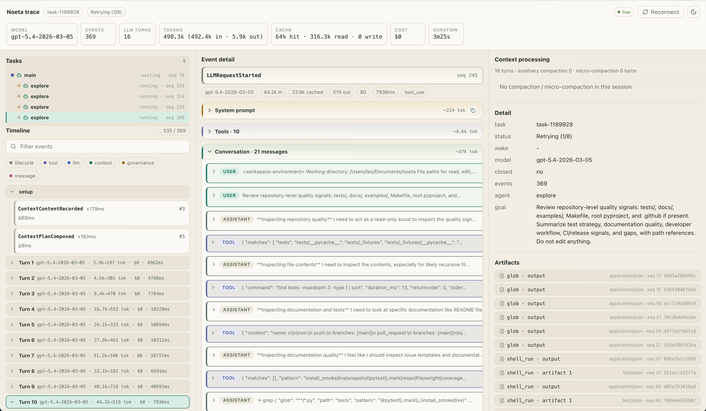

# Noeta

[English](README.md) · **简体中文**

**[文档站](https://initxy.github.io/noeta/zh/)** · [快速开始](https://initxy.github.io/noeta/zh/tutorials/quickstart/) · [SDK 参考](https://initxy.github.io/noeta/zh/reference/sdk/) · [配置 provider](https://initxy.github.io/noeta/zh/how-to/configure-provider/)

> 面向 AI agent 的开源可自托管运行时——持久、可审查、provider 中立。

Noeta 把 agent 执行循环——工具、sub-agent、MCP、human-in-the-loop——架设在一条**持久化的 event log** 之上。这一个设计选择，换来了普通进程内 agent 库给不了你的三件事：

- **任务能扛住崩溃**，从中断处原样恢复继续跑。
- **任务能挂起数小时甚至数天**，等待人工、定时器或 sub-task，等条件满足时被精确唤醒一次（exactly-once）。
- **每一步都被记录**——每次 LLM 调用、工具调用、审批——所以 agent 到底做了什么，你都能检查、审计、replay。

它通过同一套内部协议对接 Anthropic 和任意 OpenAI 兼容模型，你永远不会被绑死在某个厂商上。而且整套技术栈可以**离线、无需 API key** 运行，三十秒就能上手。

<p align="center">
  
  <br>
  <em>内置 coding-agent web 应用——一条命令（<code>python -m noeta.agent</code>）就能启动 agent 和这个界面。</em>
</p>

<p align="center">
  
  <br>
  <em>每个任务都有完整 trace——每个事件、每次 LLM 调用、每个 token/cache 统计，直接读自 event log。</em>
</p>

## 为什么选择 Noeta

- **扛得住崩溃** —— 任务状态从不跨运行保留在内存里，而是按需从只追加的 event log 里 *fold（折叠）* 重建。中途杀掉进程，一个全新进程把日志 fold 回到准确的那一点，把活干完——精确一次。
- **彻底可审查** —— 每个事件、每次 LLM 调用、每次工具调用、每个 token/cache 统计都是一个记录下来的事件。trace 视图（以及原始日志）回答的是某一步*为什么*发生——哪个工具、以谁的权限运行、什么被 compact 掉了——而不只是*发生了什么*。
- **为长程任务而生** —— 任务可以挂起，去等一个人工审批、一个结构化提问、一个定时器，或一个 sub-task，等条件触发时被精确唤醒一次。睡着的时候不占用任何成本。
- **provider 中立** —— Anthropic 和任意 OpenAI 兼容端点都在同一套内部协议背后。切换厂商只是改接线，不是重写，记录下来的历史也不绑定任何厂商的形态。
- **自带 agent** —— 运行时负责托管和调度；policy、工具、上下文由你提供。仓库内置了一个 ReAct policy 和一个完整 coding agent，但你完全可以不用它们。
- **开箱即离线** —— 确定性的 `stub` provider 让整套技术栈在没有 API key、没有网络的情况下跑通，因此安装、存储、接线都能在全新 checkout（以及 CI）上验证。

## 快速开始

```bash
pip install noeta-agent   # 自动拉入 SDK + runtime
python -m noeta.agent     # 启动离线 stub coding agent + 内置 web UI
```

不需要 API key——默认的 `stub` provider 是一个确定性 LLM 替身。打开打印出的 URL 并发一条消息。同样的启动，用代码写出来：

<!-- runnable: smoke -->
```python
from noeta.agent.backend.lifecycle import BackendConfig, serve_backend

# 默认完全离线：两轮 stub provider，:memory: 存储。
# port=0 绑定一个操作系统分配的端口。工作目录是当前目录。
config = BackendConfig(port=0)
server, url, shutdown = serve_backend(config)
try:
    assert url.startswith("http://")
finally:
    shutdown()
```

下一步：[快速开始教程](https://initxy.github.io/noeta/zh/tutorials/quickstart/)会走一遍引导式路径（安装 → 运行 → 打开 web UI → 查看 trace）。要接入真实的 Anthropic 或 OpenAI 兼容模型，请看[配置 provider](https://initxy.github.io/noeta/zh/how-to/configure-provider/)。要在 SDK 上构建自己的 agent——定义 `@tool`、组装 `Options`、调用 `query()`——从[你的第一个 agent](https://initxy.github.io/noeta/zh/tutorials/first-agent/)和可运行的 [`examples/`](examples/)开始。

## 它是怎么工作的

有一个想法贯穿始终：**状态是日志之上的一次 fold，而不是攥在内存里的一个东西。**

agent 走的每一步——每次 LLM 调用、工具调用、审批、挂起——都被追加进一份逐任务的 **event log**。任务的当前状态在需要时从这份日志 *fold（回放）* 得出。运行之间，没有任何持久的东西留在进程内存里。

因为日志是唯一事实来源，那些难的部分就不再是彼此独立的功能，而变成了*同一个*机制：

- **Resume（恢复）** 只是再 fold 一次——重新打开日志、fold、接着跑。
- **崩溃恢复** 就是由另一个进程再 fold 一次。
- **挂起 / 唤醒** 是把任务停在一个条件上，被匹配到后精确重新入队一次。
- **Compaction（压缩）** 是一个记录下来的事件——摘要在组装上下文时叠加上去，原始消息仍在日志里，所以它可审计、可复现。

大对象（工具输出、文件、snapshot）存在一个内容寻址的 store 里，日志指向它。工具的副作用可以跑在宿主机上，或者——当你不信任这个 agent 时——跑在一个沙箱容器里，两种情况下日志看起来都一样。完整图景见[事件溯源](https://initxy.github.io/noeta/zh/concepts/event-sourcing/)和[唤醒与恢复](https://initxy.github.io/noeta/zh/concepts/wake-resume/)。

## 只用你需要的那一层

Noeta 以三个包发布，每一层都会自动拉入它下面的层：

| 包 | 你得到什么 | 类比 |
| --- | --- | --- |
| `noeta-runtime` | 纯引擎——event log、fold、调度器、工具、policy。进程内嵌入。 | —— |
| `noeta-sdk` | 你 import 的客户端门面：`query()`、`Client`、`Options`、`@tool`。 | Claude Agent SDK |
| `noeta-agent` | 开箱即用的 coding agent + web UI + HTTP/SSE server。 | Claude Code |

装 `noeta-sdk` 来构建你自己的 agent（`import noeta.sdk`）；装 `noeta-agent` 来运行内置产品。唯一的公开面是 `noeta.sdk`——底下的引擎是一个你从不直接碰的传递依赖。

## 对比

Noeta 和 Claude Agent SDK 都给你 agent 循环、工具、MCP 和 sub-agent。区别在底下的脊梁：SDK 记录的是一段*对话*；Noeta 记录的是*事件*，状态由它们 fold 出来。正是这本账本，让崩溃恢复、持久唤醒、可逆 compaction 和完整审计落在同一个机制上，而不是四个。

完整对比（对 Claude Agent SDK、LangGraph、Temporal）见[服务端对比](https://initxy.github.io/noeta/zh/reference/comparison/)。

## 文档

完整文档渲染在 **[initxy.github.io/noeta](https://initxy.github.io/noeta/zh/)**（中文路径）。同样的文件以 `*.zh.md` 与英文一起位于 [`docs/`](docs/) 下，可直接在源码中浏览。

| 层 | 从这里开始 | 什么时候读 |
| --- | --- | --- |
| 教程（Tutorials） | [快速开始](https://initxy.github.io/noeta/zh/tutorials/quickstart/) | 你是新手，想让它跑起来。 |
| 操作指南（How-to） | [配置 provider](https://initxy.github.io/noeta/zh/how-to/configure-provider/) | 你有具体任务要完成。 |
| 概念（Concepts） | [事件溯源](https://initxy.github.io/noeta/zh/concepts/event-sourcing/) | 你想理解设计。 |
| 参考（Reference） | [SDK 参考](https://initxy.github.io/noeta/zh/reference/sdk/) | 你需要精确的 API 事实。 |

更深的内容：[架构概览](https://initxy.github.io/noeta/zh/architecture/overview/)、[故障排查](https://initxy.github.io/noeta/zh/operations/troubleshooting/)，以及记录每个跨模块决策的 [ADR](https://initxy.github.io/noeta/zh/adr/)（术语表在 [`CONTEXT.md`](CONTEXT.md)）。

## 状态与范围

Noeta 处于早期 pre-1.0 预览阶段。它能跑、有测试、核心稳定——但一些边界是有意划定的：

- **并发与恢复已交付，但有边界。** 单机多 worker 池、基于共享 Postgres 的多主机协调（lease fencing、数据库时钟过期）、持久 exactly-once wake，以及步骤中途崩溃恢复，如今都能用。仍有边界：多主机 fencing 仅限 Postgres（SQLite / 内存仍为单机），且崩溃步骤的副作用是被拎出来供人审查、而非自动回滚——见[已知限制](https://initxy.github.io/noeta/zh/operations/limitations/)。
- **Human-in-the-loop 已端到端** —— 审批、结构化提问、定时器 wake 都可用；缺的是任务开始等待人工时的带外通知（webhook / 收件箱）。
- **web 应用是一个小型 Vite MPA**，使用原生 ES 模块；预览阶段不计划迁移到任何框架。

## 贡献

开发设置和仓库布局在 [`CONTRIBUTING.md`](CONTRIBUTING.md)；工作约定（人类或 agent）从根目录的 [`AGENTS.md`](AGENTS.md) 入口开始。

## 许可证

Apache License 2.0—— 见 [`LICENSE`](LICENSE)。
