# Architecture overview

A top-down walkthrough of Noeta's architecture: how the packages stack, how
the core event-sourcing decision shapes each layer, and where the extension
surfaces sit. For "what is X" questions this page links to the
[concept pages](../README.md) rather than re-explaining; for exact API
signatures see the [reference pages](../README.md).

## The three packages

Noeta ships as two libraries plus one application, stacked so that higher
means closer to the product:

| Package | Location | Role |
| --- | --- | --- |
| `noeta-runtime` | `packages/noeta-runtime` | The pure engine plus the framework material that runs on it: events, fold, snapshot, the Worker/Dispatcher, storage adapters, Guards, Observers, the ReAct Policy, builtin tools, provider adapters, the ContextComposer, and the official preset agents. Depends on nothing above it and on no specific vendor. |
| `noeta-sdk` | `packages/noeta-sdk` | A thin in-process client facade: `query` / `Client` / `Options` / `@tool` and the re-exported extension interfaces. No engine internals, no HTTP. |
| `noeta-agent` | `apps/noeta-agent` | The official coding-agent application: an HTTP/SSE backend consuming the SDK in-process, plus the bundled web frontend (`apps/web`). The only layer with a network surface; entry point `python -m noeta.agent`. |

  
   
  <em>The app drives the SDK in-process; the SDK forwards into the runtime's engine, materials, and storage. Arrows are call paths.</em>

All three contribute subpackages to one shared PEP 420 `noeta.` namespace, so
import paths stay put even if the distribution boundary shifts. The
dependency direction is not left to discipline — import-linter enforces it in
CI: the runtime kernel may not import a provider package, the SDK may not
import the application, and application code may import only `noeta.sdk`
(with two deliberate exemptions: `noeta.storage` for wiring a concrete
backend, and `noeta.read_models` for read-only projections). The public
surface for users is `noeta.sdk` alone; `noeta-runtime` arrives as a
transitive dependency they never import directly.

## Ground truth: state = fold(log)

The decision everything else derives from: a task's ground truth is its
append-only EventLog, and state at any moment is computed by folding that
log — never stored as a first-class copy. The concept and its consequences
are covered in [Event sourcing](../concepts/event-sourcing.md) and
[Fold & snapshot](../concepts/fold-and-snapshot.md); this section records the
two architecture-level mechanisms that make the promise hold in practice.

### Four state slices, one writer each

If anything could mutate state without an event, fold's rebuild would stop
matching what actually ran. Task state is therefore cut into four typed
slices, each with exactly one writer:

| Slice | Sole writer | Holds |
| --- | --- | --- |
| `RuntimeState` | Engine | the rolling conversation-message stream, per-turn usage |
| `TaskState` | Policy — only via a state patch in a Decision | todos, decision records, activated skills |
| `ContextState` | fold's compaction / thinking handlers | context plan ref, compaction summary, stripped-off thinking |
| `GovernanceState` | fold, accumulated from events | cost, iteration count, token counts, subtask results |

The most telling cell is `TaskState`: the Policy cannot assign to its own
long-horizon memory. It attaches a `TaskStatePatch` to the Decision it
returns; the Engine lands that as an event; fold writes it back. Envelopes
also carry an `origin` marker recording which role wrote them (engine, model,
tool, observer, system), and a message the Policy synthesizes has its origin
scrubbed before entering the stream so it cannot impersonate another writer.

### Folding old recordings across versions

Event payloads and state slices evolve, but a Task suspended months ago must
still fold under today's code. The canonical rendering layer (see
[Fold & snapshot](../concepts/fold-and-snapshot.md)) carries this with two
symmetric rules:

- **Adding a field must not break old recordings.** A new field is appended
  at the end of its slice, given a default, and omitted from the byte stream
  when empty — so an old recording (which never had the field) and new code
  (folding it to the default) stay byte-equal.
- **Removing a field must not crash old snapshots.** When restoring an old
  snapshot, keys the current version no longer recognizes are filtered out
  rather than passed to a constructor that would reject them.

One side guarantees "the same present folds to the same bytes"; the other
tolerates "a past written by a different version." Where a snapshot predates
required fields entirely, fold discards it and replays from the top — slower,
never wrong.

## The execution stack

### Engine

The Engine advances one Task by one step —
[compose → decide → dispatch](../concepts/engine-execution.md) — and knows
nothing of Workers, the Dispatcher, or HTTP. Its class body is held under a
500-line budget: the control flow only routes Decisions, and the actual
work — emitting envelopes, running tools, spawning subtasks — is delegated to
peripheral handlers. The budget is a readability goal enforced by a lint
script, not a hard limit.

### Worker, Dispatcher, Lease

The Dispatcher owns scheduling: task enqueue, Lease granting, wake-event
delivery, and stale reclamation. A Worker drives the loop:

1. `dispatcher.lease(…)` returns a
   `Lease(lease_id, task_id, expires_at, wake_event?)` — an exclusive,
   heartbeat-renewed hold on one Task.
2. The Worker folds the EventLog into a `RuntimeState`.
3. If `lease.wake_event` is set, the Worker calls `engine.note_woken(…)`,
   which writes a durable `TaskWoken` envelope.
4. The Worker calls `engine.run_one_step(task, lease_id=…)` repeatedly until
   the Task suspends or terminates.
5. The Worker calls `dispatcher.release(lease_id, next_state=…, wake_on=…)` —
   or `dispatcher.fail(…)` on an unexpected exception.

The single-writer invariant is enforced here mechanically: the EventLog
consults the Dispatcher (as `LeaseRegistry`) on every `emit(lease_id=…)`, so
only the holder of an active Lease can write to a Task's stream. Observers
see each envelope synchronously after it commits, on the writer thread but
outside the writer lock, with exceptions swallowed.

The drain loop ships as a library primitive, `noeta.runtime.worker.WorkerLoop`
— there is no operator CLI. The bundled agent runs one in-process; embedders
call `WorkerLoop(…).run_forever(…)` themselves (see the
[WorkerLoop reference](../reference/worker-loop.md)).

### Durable wake: the machinery

[Wake & resume](../concepts/wake-resume.md) states the guarantee —
single-worker durable exactly-once delivery. The mechanism:

- The Dispatcher matches an incoming wake event to a suspended Task by
  projection and holds the match durably. Delivery happens at lease time via
  `Lease.wake_event`.
- The Worker threads the wake into `engine.note_woken`, which writes
  `TaskWoken(wake_event=…)` before the step continues. This write is the
  durability commit point.
- The match **survives the lease**: it is cleared only by a consuming
  `release(consumed_wake_event=…)`. A Worker crash between lease and the
  `TaskWoken` write leaves the wake in place; `requeue_stale()` returns the
  Task to ready, and the next lease re-delivers the same wake.
- Consumption is idempotent. The Worker's woken branch is a recovery state
  machine keyed on the latest matching `TaskWoken` envelope: a re-delivery
  whose `TaskWoken` already landed is reconciled without emitting a second
  one.
- A resume attempt on a suspended Task with no queued wake reports a typed
  `suspended_without_wake_event` — a diagnostic meaning "waiting for
  something that has not happened yet," not a fault.

The guarantee is scoped single-host / single-worker. A crash mid-step
(after `TaskWoken` but before the step's remaining envelopes land) recovers
on the next lease: the interrupted attempt is sealed and re-driven
automatically when side-effect-free, or the Task is parked for a human. The
open edge — multi-worker fencing — and the recovery scope are catalogued in
[known limitations](../operations/limitations.md).

## Context assembly

Per step, the ContextComposer assembles the model's View from folded state in
three segments ordered by volatility, keeping the prefix byte-stable for
provider KV-cache reuse; compaction is a recorded event rather than an
in-place edit. The design is covered in
[Composer & cache](../concepts/composer-and-cache.md). One accuracy detail
belongs here: whether compaction should trigger is judged against the real
input-token count the provider reported for the previous step (folded into
`RuntimeState`), with only the newly appended messages estimated — a
character-count heuristic systematically undercounts prompts that carry
caching, structured blocks, or images.

## Provider boundary

The Engine speaks a neutral internal protocol; vendor adapters translate at
the edge, fold vendor errors into a neutral taxonomy (transient /
context-overflow / fatal), and keep wire-only mechanics such as cache
breakpoints out of the ledger. The kernel-may-not-import-a-provider rule
above makes this structural. See
[Provider neutrality](../concepts/provider-neutrality.md).

## The SDK surface

`noeta.sdk` is the thin client: build one `Options`, then drive an agent
in-process with `query` (one turn) or `Client` (multi-turn). The load-bearing
design is a single cut through the `Options` fields:

- **Identity fields** decide how the agent thinks — system prompt, skills,
  tool set, capabilities, a custom Policy. They enter the recording and are
  reproduced verbatim on fold.
- **Wiring fields** only mount the agent onto a host — the provider instance,
  the working directory, an approval callback, observers. They stay out of
  identity, so swapping them does not perturb the recording.

The cut is mandatory because recordings must be reproducible: mix the two and
a recording fails to line up because a working directory changed.

What is open to extend is five explicit seams plus a decorator, all `Options`
fields re-exported through `noeta.sdk`:

| Seam | Extends |
| --- | --- |
| `policy` | swap the ReAct brain for your own decision function (with a `ref` so identity stays deterministic) |
| `guards` | synchronous checks before an effect (see [Guard vs Observer](../concepts/guard-observer.md)) |
| `observers` | read-only event subscribers — audit, metrics |
| `content_channels` | register a `ContentKindSpec` to place custom resident content into the semi-stable segment |
| `mcp_servers` | in-process SDK MCP tools, or connectors to external stdio / HTTP MCP servers |
| `@tool` | stamp a function with name, version, risk level, and input schema to make it a first-class tool |

What stays locked: the Engine main loop, the Dispatcher/Worker/Lease
machinery (host configuration can tune concurrency and lease timing only),
and the ThreeSegmentComposer — replacing the composer wholesale is not on the
user surface because stable-prefix reproducibility is a hard constraint; its
only open hook is the content channel. Storage backends are wired through
`HostConfig`, not `Options`, and never enter agent identity.

Defaults follow the same shape as the Claude Agent SDK's parameter table: an
agent gets the full builtin tool set (11 tools) unless narrowed by
`allowed_tools` / `disallowed_tools`, and `permission_mode`
(`default` / `acceptEdits` / `bypassPermissions`) decides whether high-risk
tools ask first. Exact signatures live in the [SDK reference](../reference/sdk.md).

## The agent layer

An agent's identity is an `AgentSpec` — a name plus the identity-side
configuration (prompt, tools, capabilities) — compiled from `Options` and
collected in a registry. The identity layer sits low in the runtime,
depending only on the protocol layer.

Four official presets ship with deliberately trimmed surfaces:

| Preset | Role | Tool surface | Delegates? |
| --- | --- | --- | --- |
| `main` | the conversational controller | full builtins + meta-capabilities (todo / ask user / delegate / skills / memory / MCP) | yes |
| `general-purpose` | a self-contained coding worker | read/write/edit + shell + web | no — a leaf |
| `explore` | a read-only scout | read-only tools only | no |
| `plan` | a read-only planner | read-only tools only | no — produces a plan |

The trimming knife is `Capabilities`: explicit switches (todo, ask-user,
delegate, skill invocation, memory, MCP, plus an allowlist of spawnable
agents) written into agent identity — not runtime restrictions bolted on.

Cooperation takes two shapes. **Single delegation**: the parent spawns one
Subtask, suspends, and wakes when it completes. **Fan-out**: the parent
spawns a group of Subtasks that run concurrently on a bounded in-process
thread pool, and the results flow back together — each result returns via a
wake event and is paired to the original tool call. Each Subtask is a full
event-sourced Task with its own log and fold, related to its parent only by
`parent_task_id`; more elaborate orchestration is expressed as one Task whose
Policy interprets a model-written orchestration script, not as a new
primitive.

## Distribution

Once ground truth converges on "fold over a durable log," distribution is
mostly a scheduling problem. Any process that can read the store can rebuild
any Task by folding; execution assumes nothing about which machine it is on.
The Lease is what keeps concurrent Workers off the same Task: lease,
heartbeat, expiry sweep, exactly-once wake delivery, and write validation in
the log itself.

The shipping shape today is single-host: a local SQLite file, one in-process
`WorkerLoop`, and fan-out as bounded in-process threads (default 8). Reaching
a multi-host cluster is a storage-adapter swap plus a worker pool — the
Engine does not change, because fold is pure and lease validation lives in
the log. That work is real but unshipped; the honest boundary list is in
[known limitations](../operations/limitations.md).

Cancellation follows the same cooperative design as the Engine's stop probes:
cancelling marks the Task; Worker and Engine stop at the next safe point; the
cascade cancels in-flight Subtasks; background shell processes are registered
and reaped when their session closes.

## Where to go next

- Concepts: [Event sourcing](../concepts/event-sourcing.md) ·
  [Fold & snapshot](../concepts/fold-and-snapshot.md) ·
  [Engine & execution](../concepts/engine-execution.md) ·
  [Wake & resume](../concepts/wake-resume.md)
- Reference: [SDK](../reference/sdk.md) ·
  [WorkerLoop](../reference/worker-loop.md) ·
  [comparison with the Claude Agent SDK](../reference/comparison.md)
- Decision records: [`docs/adr/`](../adr/README.md) — why each cross-module
  decision is the way it is.
