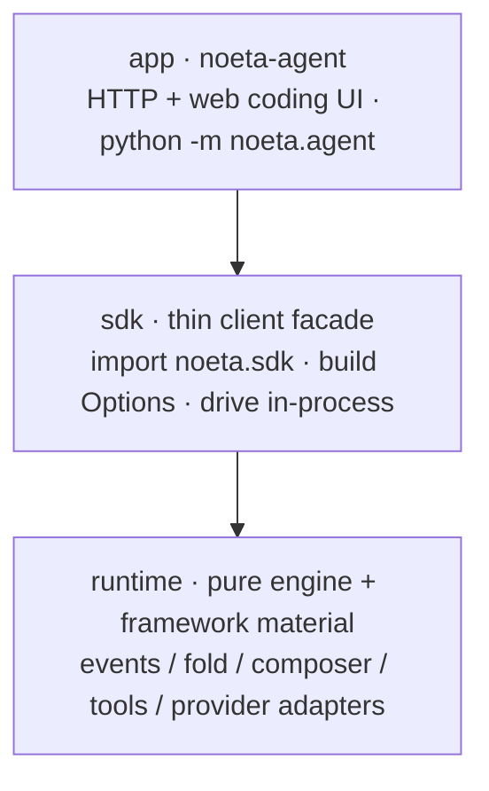
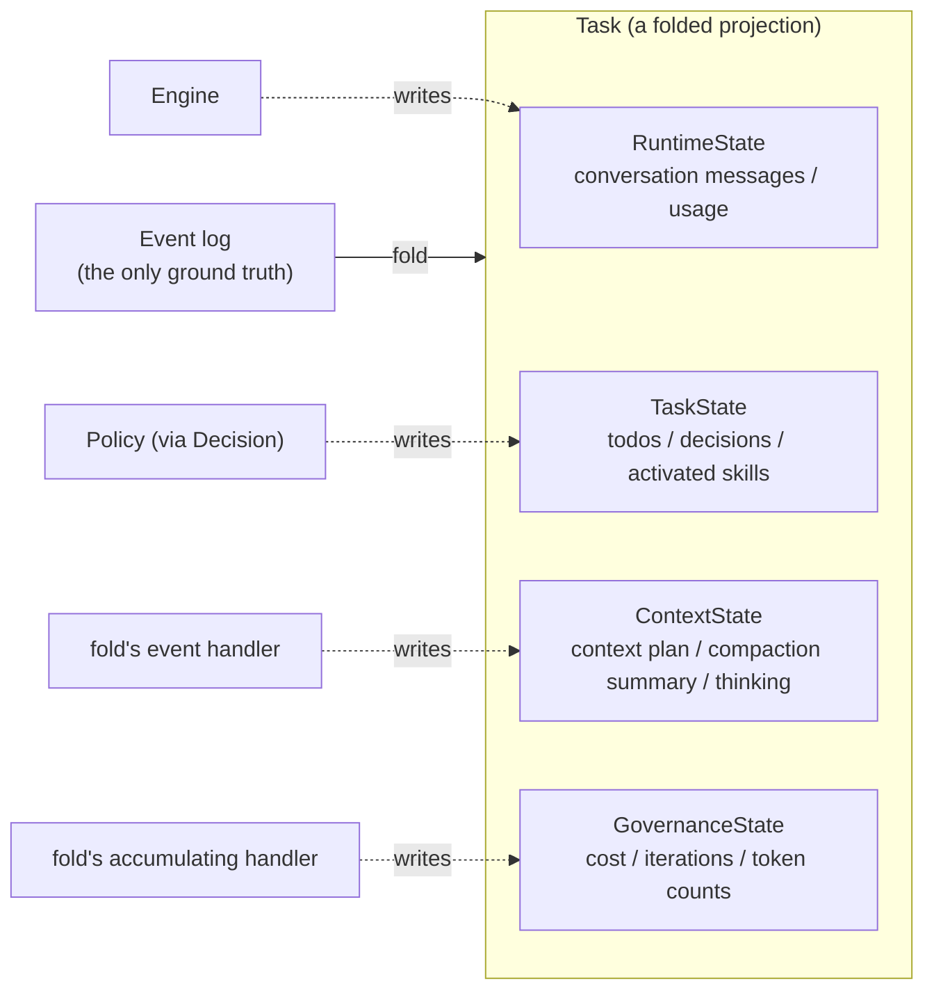
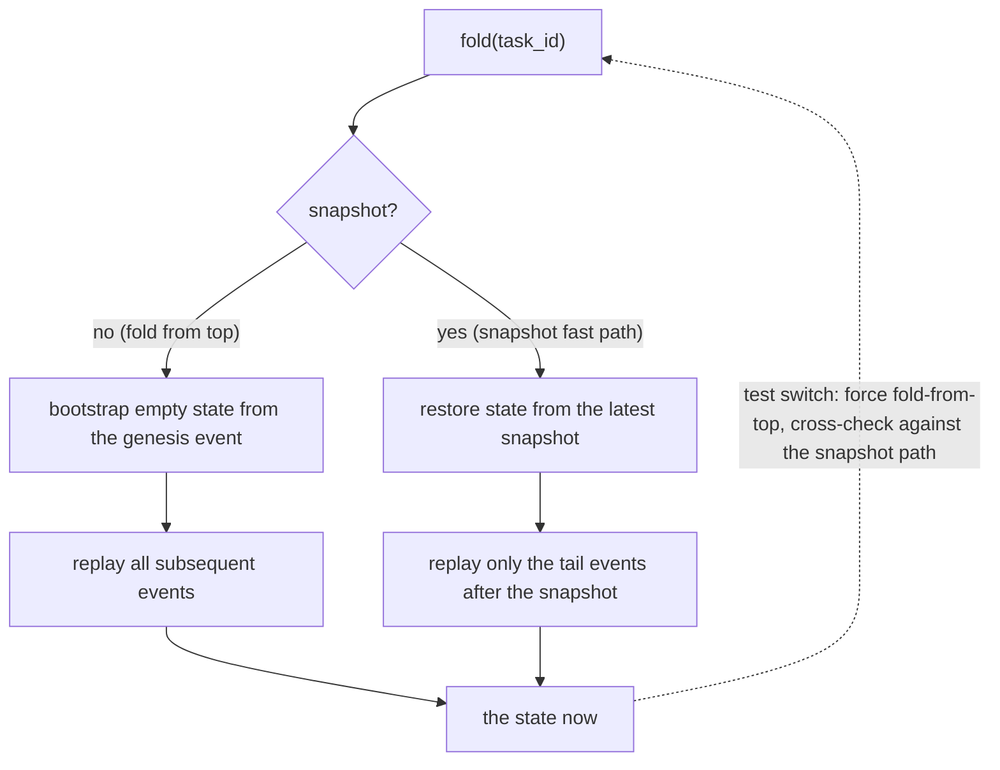
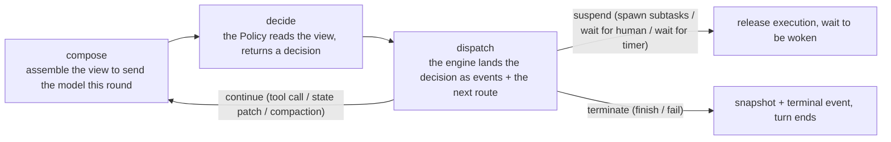
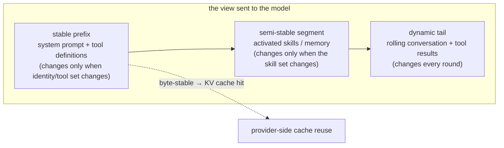
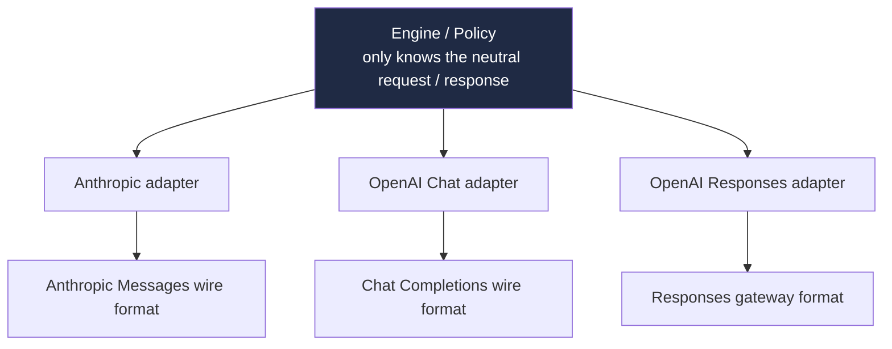
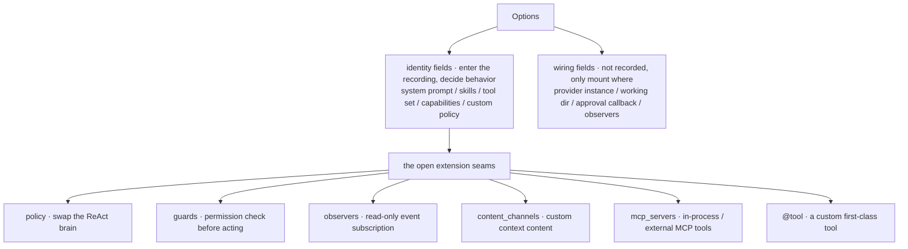
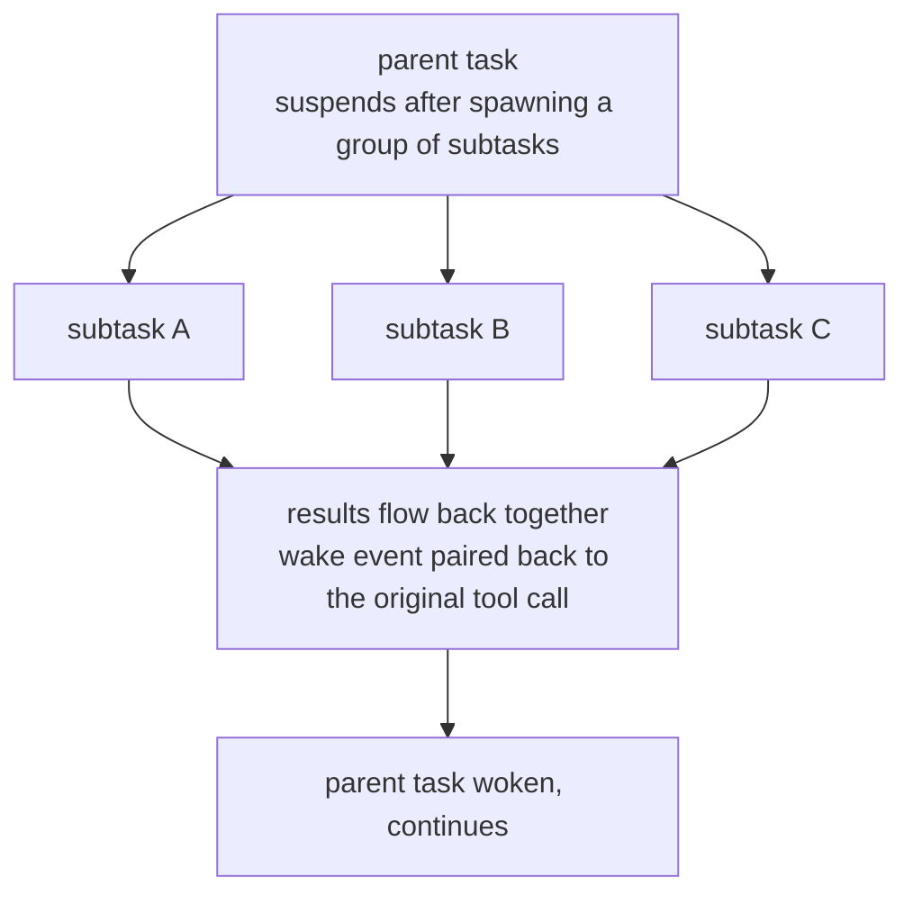
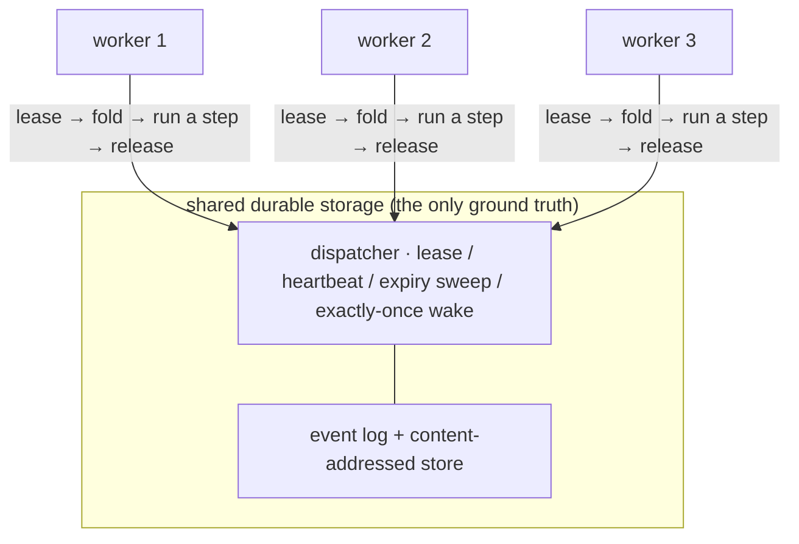

# A deep read of noeta's architecture: an event-sourced agent engine

> Written for engineers who are interested in agent-system design but have never touched noeta. It starts from one bottom-most design decision and, working top-down, derives noeta's whole architecture, contrasting with the Claude Agent SDK at every key turn.

## 1. Positioning and the big picture

noeta is an event-sourced agent engine, plus a coding-agent product built on top of it. The engine half is the star of this piece; the product half (a locally run web coding interface) gets only a passing mention here.

The code splits into three packages, stacked so that higher means closer to the product:

- **runtime**: the pure engine plus a body of framework material, the largest of the three. Events, fold, the composer, the tool framework, and the provider adapters all live here. It depends on nothing above it and on no specific vendor.
- **sdk**: a thin client facade. You import it, build Options, and drive an agent inside your own process, like calling a library.
- **app (noeta-agent)**: the official product, an HTTP service plus a web frontend, with the entrypoint `python -m noeta.agent`.

The three packages share one `noeta/` namespace (PEP 420), so import paths stay put while the distribution boundary can shift. Dependency direction between packages is not left to discipline; import-linter nails it down: the kernel may not import a vendor, the SDK may not import the product, and framework material may not depend back on the kernel. This discipline guarantees you can take the pure engine alone, or the whole product, and both usages stand on their own.

One thing is worth stating up front: this piece is almost entirely about the engine and the agent. That web frontend is really its own story — it folds the raw event stream the backend pushes over into UI in the browser, using the same fold idea as the engine; that's for another piece.

---

## 2. The core decision: state at any moment is folded, not stored

noeta does not store "current state" as ground truth. A task's ground truth is its append-only event log; the state you want at any moment is the result of folding that log from the beginning. In one line:

> the state now = fold(all events from creation to now)

The state object is a disposable projection; the log is the master copy. This one decision fixes the shape of everything downstream, so it is worth nailing down first.

### The event envelope and content addressing

Every record in the log wears the same envelope: a global id, the owning task, a monotonic sequence number the log stamps on at write time, the event type, and a typed payload. The sequence is not filled in by the caller but assigned by the log, which gives each stream a deterministic replay order; fold is exactly feeding payloads to the matching handler in ascending sequence order.

The envelope is deliberately kept small, with a payload ceiling of 4 KB. Large objects that exceed it (a chunk of conversation, a piece of model thinking, a tool artifact) do not go into the log but are written to a content-addressed store: at write time the content is hashed and a reference is returned, and only that reference stays in the log. Even a snapshot is treated as an ordinary event — its payload is just a reference pointing at the state body. So the log is forever a string of small records, the truly bulky content is deduplicated and set aside, and the rule "the log is the only ground truth" is not diluted.

### origin: who wrote it, and why that matters

The envelope also carries an origin field, marking "which role inside noeta wrote this event": the engine, the model, a tool, an observer, or the system. Behind it stands one of noeta's hard constraints, the single-writer invariant.

Why it is needed becomes clear the moment you reason backward from the definition of fold. Since state is derived entirely by folding events, then if anyone could bypass events and write directly to some field of the state object, the state fold rebuilds would no longer match the actual runtime state, and the whole thing collapses. For "rebuild equals ground truth" to hold, every single change to state must first become an event. noeta's approach is to cut state into four slices, each nailed to a single unique writer:

| Slice | Sole writer | Holds |
|---|---|---|
| `RuntimeState` | Engine | the rolling conversation-message stream, real usage for the turn |
| `TaskState` | Policy (only via a state patch in a decision) | todos, decision records, activated skills |
| `ContextState` | fold's compaction / thinking handlers | context plan ref, compaction summary, stripped-off thinking |
| `GovernanceState` | fold (accumulated from events) | cost, iteration count, various token counts, subtask results |

Four writers, each minding its own cell, never crossing. The most telling one is the `TaskState` cell: the agent's decision brain (the Policy) cannot assign to long-term memory directly when it wants to change it — it can only attach a state patch to the decision it produces, which the engine lands as an event and fold then writes back. Even a conversation message the Policy synthesizes has its origin marker scrubbed before it enters the event stream, lest it impersonate another role's handwriting. Only by locking "who may write" down this tightly can fold promise that replaying the log yields exactly what actually ran at the time.

---

## 3. fold and resume: state is computed, not stored

fold's input is stubbornly minimal: one event log, one content store, one task id, and nothing else. No clock, no randomness, no external IO. That "purity" buys a concrete capability: the same log, folded in any process on any machine, yields byte-identical state.

resume therefore has no dedicated "load state" logic at all. To recover a suspended task, fold it; to show a task to the frontend, fold it; to audit after the fact, still fold it. State is forever a computed projection, not a separately stored copy that must be kept in lockstep with the log. Without that copy, a whole class of "copy out of sync with the log" bugs disappears.

### Two paths, one result

Folding the whole log from the top every time makes long tasks slower and slower. So fold keeps a snapshot fast path, and lays down one iron rule alongside it: the two paths must fold to byte-equal state.

The snapshot path restores state from the latest snapshot and replays only the tail after it; the from-top path replays everything. fold keeps a switch to force the full replay, and tests use it to cross-check against the snapshot path, confirming the two paths fold to the same result. This iron rule pins the snapshot's status firmly to "performance accelerator" rather than a second source of truth: wipe every snapshot and the system's behavior is unchanged, only slower.

The code holds one honest trade-off too. After a certain change, older snapshots were missing a few statistical fields; the moment fold recognizes such an old snapshot it proactively discards it and falls back to full replay, waiting for the next new-version snapshot to take over acceleration again. Better slow than wrong — a priority you cannot bend in event sourcing.

### canonical: the bedrock of reproducible folding

"Byte-equal" needs someone to backstop it, and that layer is called canonical, with a single job: render any typed value into a stable byte form. The method is plain enough to state in one line — keys sorted lexicographically, separators squeezed as tight as possible, unified UTF-8. So equivalent objects render to exactly the same bytes, and the hash of the same content is identical on any machine at any moment. Content addressing leans on it to deduplicate, snapshots lean on it to cross-check, and the whole "reproducibility" of event sourcing rests on this thin layer.

### Keeping old tasks foldable across versions

Code evolves; event payloads and state slices grow new fields and retire old ones. The hard part: a task suspended months ago has its snapshot and events written by an old version, and the new version's fold still has to recognize and fold it. canonical carries this with two symmetric little mechanisms:

- **Growing an optional field must not break old recordings.** The convention is that a new field is always appended at the end of the slice, given a default, and declared "not in the byte stream when empty." An old recording never had this field, and new code folds it to the default, so both sides stay byte-equal.
- **Deleting a field must not crash old snapshots.** When restoring an old snapshot, keys the current version no longer recognizes are simply filtered out rather than jammed into the constructor to blow up. Those long-retired fingerprint-style fields were carried along by old snapshots and quietly dropped exactly this way.

One side guarantees "the same present folds to the same bytes," the other tolerates "the past of a different version." This is the precondition for event sourcing to survive in a codebase that changes daily, and the confidence that lets noeta treat the log as the only ground truth without keeping a "just in case" copy of state.

---

## 4. The engine loop: how one turn runs

The engine is the piece deliberately kept smallest of the whole, with a goal of holding the core control flow under 500 lines. It manages this by division of labor: the loop itself only "looks at the decision and routes it," while the actual work (emitting events, changing state) is all delegated to peripheral handlers. Reading the engine body, you can take in a turn from start to finish at a glance, with the details elsewhere rather than crowding this trunk. (500 lines is a goal, not a hard line — it means don't let the control flow grow too long to read.)

A turn spins through three steps in the engine, repeatedly, until the task suspends or terminates:

The middle step, decide, is the most carefully considered part of the design. The one making the decision is the Policy — the agent's ReAct brain — but it is a pure function: input the current context and view, output a decision, and that's all. It emits no events, touches no storage, and has no write permission whatsoever. It only states a position.

Splitting "stating a position" from "posting to the ledger" pays off both ways. On one side, the Policy is freely swappable — the default ReAct, a strategy you plug in yourself, even a test's fake brain, all fine — because it physically cannot reach the log, so no matter how wrongly it writes, it cannot pollute ground truth. This is exactly what the single-writer invariant from the previous section looks like from the engine side: the right to decide is open, the right to record is closed. On the other side, the engine itself gets simpler too — it need understand no specific strategy, only this small vocabulary of decisions.

The decision vocabulary itself is small, a dozen-odd neutral types: finish, fail, call tools, spawn one or a group of subtasks, yield to a human, wait for a timer, wait for an external event, apply a state patch, request compaction. The engine routes by decision type into three destinations: continue in place (tool call, state patch, compaction — emit the events, don't suspend, spin the next round), suspend (spawn subtasks, wait for human, wait for timer — release execution to wait on a wake), and terminate (finish or fail, land a snapshot and a terminal event, loop ends).

One more detail: between composing and deciding, the engine probes the cancellation signal. Cancellation in noeta is cooperative — it does not forcibly interrupt a thread but checks once at these safe points whether a stop has been requested, and if so throws out and goes through the cascading stop. This thread comes back in section nine, on distribution.

---

## 5. Context is assembled, not piled up

What the model sees each round is a view a composer assembles on the spot from the current state. The composer, like fold, is a pure function: the same state assembles the same view. It is the sole writer of the context plan.

The key design: the view is cut into three segments by "how often it changes," growing more volatile front to back.

This split is for caching. Providers cache the KV by prefix, so as long as the prefix is byte-for-byte unchanged, they can reuse the previous round's cache and stop re-billing and re-encoding that stretch. So the composer pushes everything stable to the front and keeps it byte-stable (sorted tool keys, no timestamps), and pens all the volatile parts into the tail. This is the same determinism discipline as canonical, only this time what it buys is not reproducibility but savings: cache hits.

### Compaction is also an event

When the conversation grows too long to hold, something has to be compacted. noeta's choice: compaction is not an in-place edit of history but a recorded event. The Policy decides to compact, and the engine emits a compaction event carrying a summary reference; fold reads it, and on the next assembly swaps the overwritten prefix stretch for the summary while leaving the stable prefix untouched. Two consequences:

- **Auditable and reproducible.** Compaction is in the log, so a recovered task compacts the same way; you can also dig up after the fact "exactly what was pared away and what was kept."
- **History is not scrubbed in place.** noeta does not touch the message history itself, only records a summary boundary for assembly to apply. The original messages still lie in the log; the summary is a layer overlaid on top, not an overwrite.

There is also a spin-guard here. Should compaction be triggered repeatedly while the boundary never moves forward (no real progress made), the engine will not loop forever but forcibly fails and terminates. The judgment is based on whether the boundary recorded in the log advanced, not on some flag that could get stuck.

One last easily overlooked accuracy question: whether compaction should trigger depends on how large the context really is. noeta does not roughly estimate with "character count divided by four," but takes the real input-token count the provider reported last round (already folded into runtime state) as a baseline, and roughly estimates only the newly appended messages this round on top of it. For prompts with caching, structured blocks, or images, a rough estimate systematically undercounts; this real baseline holds the error down.

---

## 6. Provider neutrality: an internal protocol as the source, adapters translating at the edge

noeta talks to large models through its own vendor-agnostic internal protocol; each vendor (Anthropic's Messages, OpenAI's Chat Completions, OpenAI's Responses gateway) gets an adapter that translates at the boundary.

The design intent states in one line: don't let any vendor's wire format become your internal contract. Had the shortcut been taken back then of lifting Anthropic's message format straight into the internal types, then other providers would be second-class citizens by birth, and vendors' various quirks would seep along that type into the engine. So noeta goes the other way: the internal shape is neutral, and the adapter handles translation in both directions — outbound (neutral to wire) and inbound (wire to neutral) — and along the way folds the vendors' assorted HTTP errors into one neutral taxonomy (transient, context-overflow, fatal), so the engine's retry and compaction logic need not care who is on the other end.

Vendor-specific tricks all stay inside the adapter and never enter the core: Anthropic's cache breakpoints (wire-only, never in the ledger), the extended-thinking round trips, image blocks with a per-model vision gate, reasoning-effort tiers. The engine stays vendor-ignorant throughout.

This neutrality is nailed down by architecture: one import rule forbids the runtime kernel from importing a provider package, so the kernel physically cannot depend on any vendor. Providers live in a "material band," and only the outermost wiring layer wires a given vendor in.

For an event-sourced system, this neutrality has a bonus. Because the events recorded into the log are of neutral shape, a task run against Anthropic can be folded and audited without installing the Anthropic SDK; the purely wire-level things (cache breakpoints, for instance) are deliberately kept out of the log, so vendor details are not welded into what is meant to be long-lived, readable ground truth.

---

## 7. The SDK: what is opened, what can be customized

noeta.sdk is that thin client library. You import it, build one Options, and drive an agent inside your own process like calling a library, without standing up a service. This section answers one question: what does this thin library open for you to change, and what does it hold shut.

The main line is a single dividing cut through Options: fields fall into two kinds, one into "identity," one merely "wiring."

Identity fields decide how the agent thinks — the system prompt, skills, tool set, capability switches, and your custom decision policy all count. Wiring fields only mount it onto some host — which provider instance, where the working directory is, an approval callback, a few observers. Why this cut is mandatory comes back, again, to that event-sourcing spine: recordings must be reproducible. Anything that changes the agent's behavior must go into identity, reproduced verbatim on fold/resume; anything that only affects "where it's mounted" stays in wiring, so swapping it once does not break the recording. Mix the two, and a recording will fail to line up just because the working directory changed.

What is opened for you to customize is five explicit extension seams, plus a tool decorator:

- **policy** swaps out the ReAct brain. Give your own decision function, with a ref so identity stays deterministic. The engine does not care how your brain thinks, only reads the decision you spit out.
- **guards** are the synchronous permission checks before acting, such as blocking a write outside the directory.
- **observers** are asynchronous subscribers to the event stream, for auditing and metrics. They are read-only and cannot write events, so the single-writer rule is not broken.
- **content_channels** register custom kinds of context content with the composer — the composer's only outward-facing seam.
- **mcp_servers** are in-process MCP tools, plus connectors to external stdio / HTTP MCP servers.

Plus the @tool decorator: stamp a function with a name, version, risk level, input schema, and description, and it becomes a first-class tool the model can call directly.

There is a trade-off on this side of the default too. An agent gets the full builtin tool set by default (read, write, edit, glob, grep, shell, web search, and so on), and you narrow it with an allowlist / denylist; the permission mode (default / auto-accept edits / fully automatic) decides whether a high-risk tool must ask first before running.

The restraint of this layer: all five seams are real interfaces, but noeta does not carve a seam out of thin air just because "maybe someone will want to swap it later." The engine itself is not a place you reach into and change; you change behavior by composing Options, not by inheriting internal classes. This Options surface is also deliberately shaped against the claude-agent-sdk parameter table (system prompt, tool allowlist, MCP, permission mode, subagents all line up); the specifics of the differences are left to section ten.

---

## 8. The agent layer: identity, the four presets, and multi-agent orchestration

Above the SDK is the agent layer, which answers three things: what an agent actually is, which ones the official set gives you, and how multiple agents cooperate.

An agent's identity is a spec: a name, plus the configuration that goes into identity (prompt, tools, capabilities). A registry collects the compiled specs together. This identity layer is placed very low, depending only on the bottom-most protocol layer, serving as a stable spine.

The four official presets each have a deliberately trimmed capability surface:

| Preset | Role | Tool surface | Can delegate? |
|---|---|---|---|
| `main` | main controlling conversational agent | full builtins + meta-capabilities (todo / ask user / delegate / skills / memory / MCP) | yes |
| `general-purpose` | a self-contained coding worker | read/write/edit + shell + web, 9 in total | no (a leaf) |
| `explore` | a read-only scout | the read-only few (glob / grep / read / shell reads / webfetch) | no |
| `plan` | a read-only planner | same as explore, all read-only | no, only produces an implementation plan |

The knife that trims this cut is called capabilities, an explicit set of capability switches: todo, ask user, delegate, skill invocation, memory, MCP, plus an allowlist of "which subordinates can be spawned." explore cannot write files, plan cannot change code, general-purpose cannot delegate further down — none of these are limits added at runtime, but capability boundaries written into agent identity.

How multiple agents cooperate has two shapes:

- **Single delegation**: the parent task spawns one subtask, suspends itself, and is woken when the subtask finishes.
- **Fan-out**: the parent task spawns a group of subtasks that run concurrently (a bounded thread pool), and the results flow back together. This is noeta's parallelism.

Results return to the parent task via a wake event and are then paired back to the original tool call. More complex orchestration also has the workflow: let the model write an orchestration script itself that deterministically spawns many agents, with loops, branches, and pipelines — the model is writing control flow, not just calling tools one by one.

This layer joins the spine tightly: each subtask is its own event-sourced task, with its own log, its own fold, and the parent-child relationship in the events too (a parent_task_id field). So "multi-agent" is, at bottom, many tasks, each independently foldable and recoverable. This leads straight to the next section.

---

## 9. Distribution: the substrate for cluster concurrency

Once state is converged onto "fold over a durable log," distribution comes almost as a byproduct. All of a task's ground truth is in shared storage, and any process that can read that storage can, by folding once, rebuild the task exactly. Execution makes no assumption about which machine it happens on.

Only one problem remains: with multiple workers on the job at once, how not to step on the same task. noeta's answer is the lease. A worker leases a ready task, gets exclusive rights, runs a step, renews the lease with a heartbeat, and releases when done (the task goes back to suspended or terminal). The event log validates on write: only the holder of an active lease may write. If a worker crashes mid-run, its lease expires, a sweep puts the stranded task back on the ready queue, and another worker takes over. Wake delivery is also exactly-once: the wake is in place at lease time, consumed only after the run completes, and re-delivered on crash.

This is the standard look of a distributed task queue: lease, heartbeat, expiry reclamation, exactly-once. The storage protocol is abstract, and the durable adapter wired in today is local SQLite.

Here it needs to be said plainly. The noeta-agent product currently runs in a single-machine form: a local SQLite file, a single-process worker loop, no network storage, no worker pool; multi-agent fan-out is in-process thread concurrency (bounded, default 8). So the accurate phrasing right now is "single-machine concurrency." But getting to a multi-machine cluster is not a matter of rewriting the engine — it is swapping out the adapter at the storage layer (local SQLite for network storage) and standing up a worker pool. The engine need not change, because fold is a pure function and lease validation lives in the log, so it knows nothing of "which machine it runs on." The distance to a cluster comes down to swapping one storage adapter.

Cancellation follows this same design: cancellation is cooperative, marking a task, and the worker and engine stop the moment they poll it at a safe point; the cascade cancels in-flight subtasks along with it; a shell process started in the background is registered and reaped when the session closes.

---

## 10. Contrast with the Claude Agent SDK

noeta's SDK surface is traced against the Claude Agent SDK — both have the agent loop, tools, MCP, subagents, sessions. The difference is not in those nouns but in the spine underneath: noeta makes state event-folded, the SDK does not. The table below lines up the contrast, then three points are unfolded.

| Dimension | Claude Agent SDK | noeta |
|---|---|---|
| state / session | session JSONL, an append-style conversation log, auto-persisted | event-sourced log + content-addressed store, state = fold(events) |
| recovery | resume / fork by session id, replay the conversation to continue | fold; refolding the log is recovery, with no separate load logic |
| context compaction | auto-summary, irreversible, interceptable by a PreCompact hook | compaction is an event, auditable, reproducible, original history not scrubbed |
| provider | the SDK configures multiple backends (Anthropic / Bedrock / Vertex / Azure) | a neutral internal protocol, each vendor via an adapter, the kernel forbidden to depend on any vendor |
| tools | builtin tools + @tool + in-process SDK MCP server | builtin tools + @tool (with version / risk level) + MCP (stdio / HTTP) |
| permissions | permission_mode + canUseTool + a hook chain | permission_mode + guards (permission before acting) |
| extension | hooks, imperative interception (Pre/PostToolUse, etc.) | five extension seams, plus the single-writer constraint (observers are read-only) |
| subagents | agents definitions, output returns to the parent, nesting ≤ 5 levels | subtasks are independent event-sourced tasks, fan-out concurrency, results flow back via wake |
| concurrency / distribution | a single query / client in-process | a distributed-queue substrate of lease + durable log (currently shipping single-machine) |
| shape | a TS / Python library, sending straight to the Claude API | three packages runtime / sdk / app, Options traced against the SDK parameter table |

Three differences spelled out.

**The shape of ground truth.** session JSONL is also an append log, but what it records is the conversation; noeta records events, and state is a projection folded out of the events. One is like a recording of a conversation, the other like a state machine's ledger. The ledger lets resume, compaction, and audit land on one mechanism: resume is a refold, compaction is a recorded event, audit is another fold. The recording line has to fit out a separate set of logic for recovery, compaction, and audit each.

**The reversibility of compaction.** The SDK's auto-compaction is summary-style: the original content is displaced by a summary, and the process is irreversible (to archive it you rely on a PreCompact hook grabbing a copy yourself). noeta's compaction only records a summary boundary into the log; the original messages are still in the log, and the summary is overlaid at assembly time. So the same task, recovered, compacts the same way, and you can dig up what was actually pared away at the time.

**The provider boundary.** The SDK supports multiple backends, but the shape is Anthropic-centric. noeta makes the internal protocol a vendor-neutral canonical, then forbids the kernel to depend on any vendor with one import rule. The cost is an extra adapter layer per vendor; the return is recordings not bound to a vendor, and tasks that can be folded and audited without installing any vendor's SDK.

These differences do not prove one is better, only that the two optimize for different things. The Claude Agent SDK optimizes for "a light, handy client that drives a well-hosted agent"; noeta optimizes for "making the engine itself a reproducible, foldable, vendor-neutral core." Want it out of the box and tracking official capabilities closely — the former is less trouble; want to turn an agent's running into a ledger that can be replayed, audited, and carried elsewhere to continue — this spine is what makes the latter worth it.

---

If you take away one line: in noeta, state is not stored, it is computed. Most of the rest of the trade-offs across the architecture are the interest on that one line.
