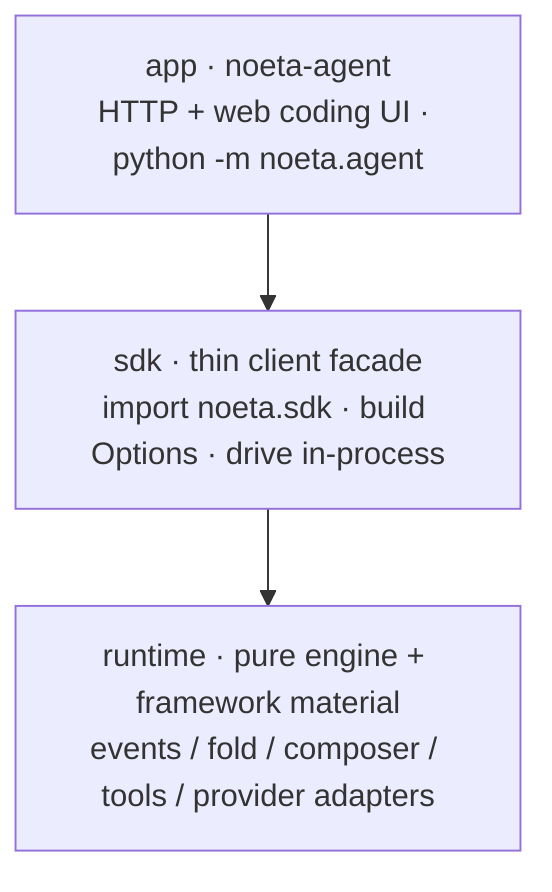
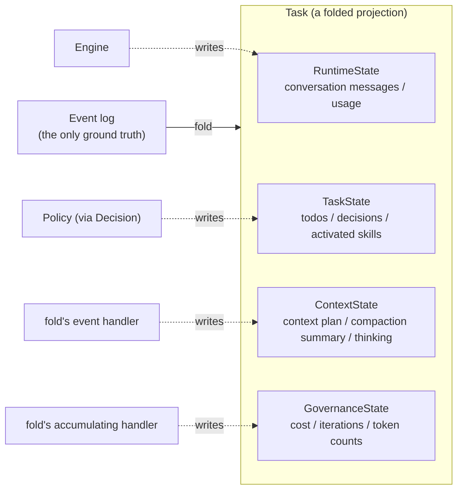
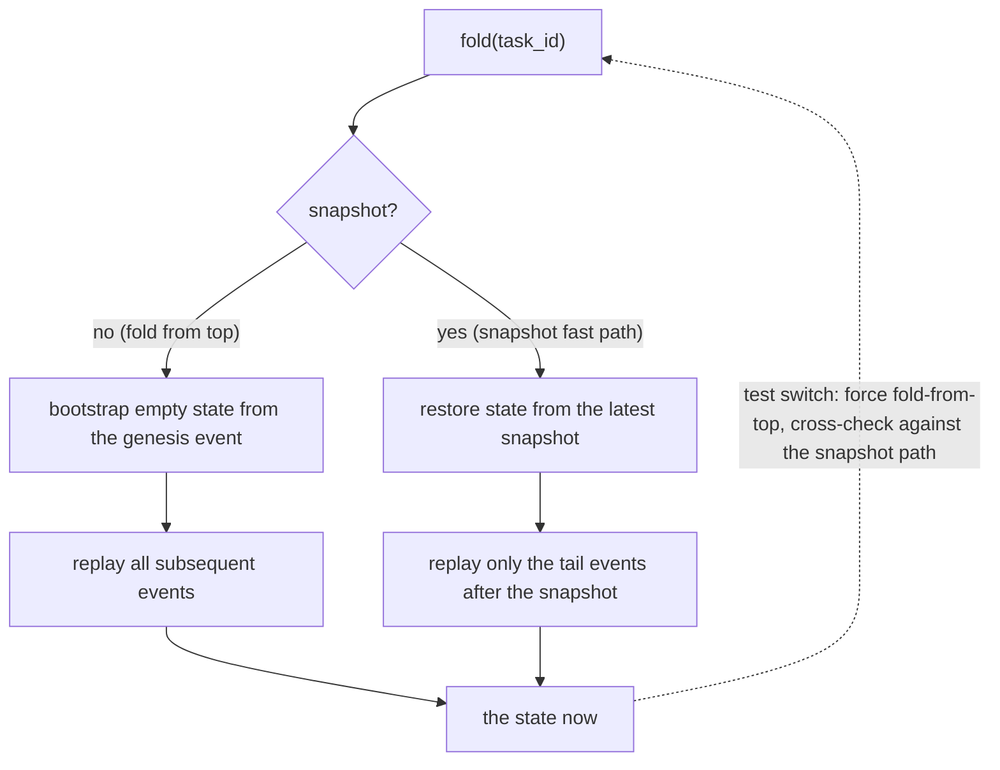
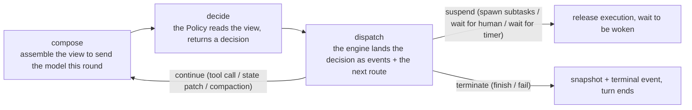
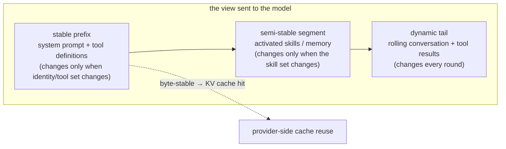
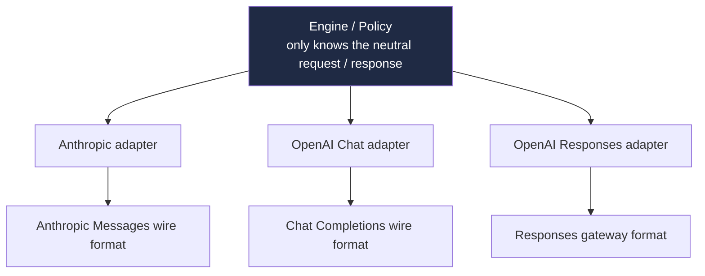
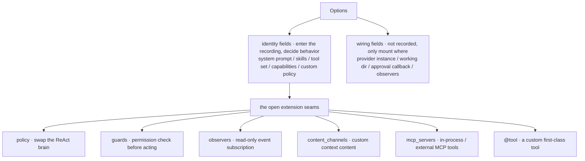
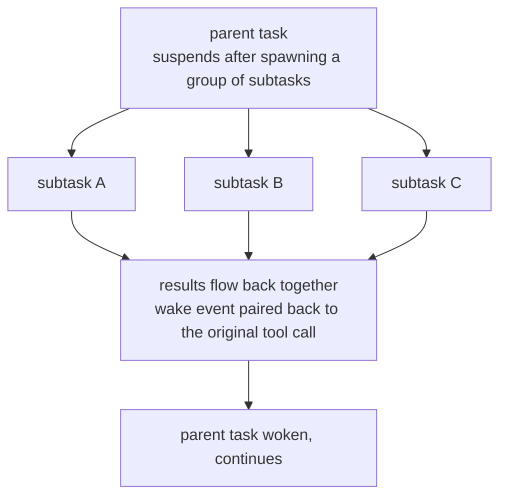
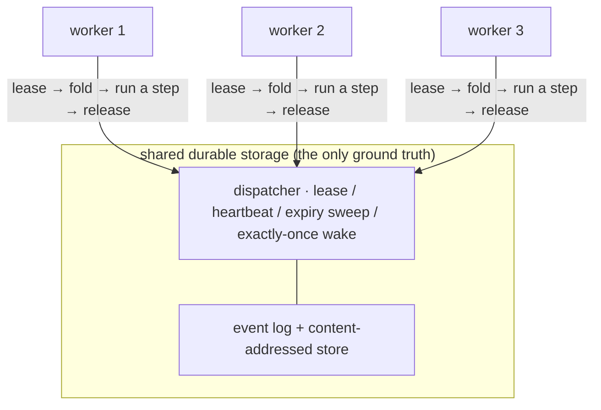

# 深入阅读 noeta 架构：事件溯源代理引擎 { #a-deep-read-of-noetas-architecture-an-event-sourced-agent-engine }

> 为对代理系统设计感兴趣但从未接触过 noeta 的工程师撰写。它从一个最底层的设计决策开始，自顶向下地推导出 noeta 的整个架构，在每个关键转折点与 Claude Agent SDK 进行对比。

## 1. 定位与大局 { #1-positioning-and-the-big-picture }

noeta 是一个事件溯源代理引擎，加上一个构建在其上的编码代理产品。引擎部分是本文的主角；产品部分（本地运行的 Web 编码界面）在此仅作简要提及。

代码分为三个包，堆叠方式使得越高意味着越接近产品：

- **runtime**：纯引擎加上大量框架材料，三者中最大。事件、fold、composer、工具框架和 provider adapters 都在这里。它不依赖其上方的任何东西，也不依赖任何特定供应商。
- **sdk**：一个薄客户端 facade。你导入它，构建 Options，然后在自己的进程内驱动代理，就像调用库一样。
- **app（noeta-agent）**：官方产品，一个 HTTP 服务加上一个 Web 前端，入口点是 `python -m noeta.agent`。

三个包共享一个 `noeta/` 命名空间（PEP 420），因此导入路径保持不变，而分发边界可以变化。包之间的依赖方向不留给纪律；import-linter 将其钉死：kernel 不得导入 vendor，SDK 不得导入 product，框架材料不得依赖回 kernel。这种纪律保证你可以单独使用纯引擎，或整个产品，两种用法都独立成立。

有一件事值得预先说明：本文几乎完全关于引擎和代理。那个 Web 前端实际上是它自己的故事——它将后端推送的原始事件流 fold 成浏览器中的 UI，使用与引擎相同的 fold 思想；那是另一篇文章的内容。

---

## 2. 核心决策：任何时刻的状态是 fold 出来的，不是存储的 { #2-the-core-decision-state-at-any-moment-is-folded-not-stored }

noeta 不将"当前状态"存储为真相。任务的真相是其仅追加的事件日志；你在任何时刻想要的状态是从开头 fold 该日志的结果。用一行说：

> 现在的状态 = fold(从创建到现在的所有事件)

状态对象是一次性投影；日志是主副本。这一个决策决定了下游一切的形状，因此值得首先钉死。

### 事件信封和内容寻址 { #the-event-envelope-and-content-addressing }

日志中的每条记录都穿着相同的信封：一个全局 id、所属任务、日志在写入时加盖的单调序列号、事件类型和类型化载荷。序列不是由调用者填写的，而是由日志分配的，这给每个流一个确定性重放顺序；fold 正是按升序顺序将载荷馈送给匹配的 handler。

信封被故意保持很小，载荷上限为 4 KB。超过它的大对象（一段对话、一块模型思考、一个工具 artifact）不进入日志，而是写入内容寻址存储：在写入时对内容进行哈希并返回引用，只有该引用留在日志中。即使是 snapshot 也被视为普通事件——其载荷只是指向状态主体的引用。因此日志永远是一串小记录，真正庞大的内容被去重并搁置一旁，"日志是唯一真相"的规则没有被稀释。

### origin：谁写的，以及为什么这很重要 { #origin-who-wrote-it-and-why-that-matters }

信封还带有一个 origin 字段，标记"noeta 内部哪个角色写了这个事件"：引擎、模型、工具、observer 或系统。在它背后站着 noeta 的硬约束之一，单写者不变量。

为什么需要它，从 fold 的定义往回推理的那一刻就清楚了。由于状态完全由 fold 事件推导，那么如果任何人可以绕过事件直接写入状态对象的某个字段，状态 fold 重建将不再匹配实际运行时状态，整个事情就崩溃了。为了"重建等于真相"成立，对状态的每一个更改必须首先成为一个事件。noeta 的方法是将状态切成四个切片，每个钉在一个唯一的写入者上：

| 切片 | 唯一写入者 | 持有 |
|---|---|---|
| `RuntimeState` | Engine | 滚动对话消息流、该轮的实际使用量 |
| `TaskState` | Policy（仅通过决策中的状态补丁） | todos、决策记录、激活的技能 |
| `ContextState` | fold 的压缩 / 思考 handlers | 上下文计划 ref、压缩摘要、剥离的思考 |
| `GovernanceState` | fold（从事件累积） | 成本、迭代计数、各种 token 计数、子任务结果 |

四个写入者，各自照看自己的单元格，从不交叉。最能说明问题的是 `TaskState` 单元格：代理的决策大脑（Policy）想要更改长期记忆时不能直接赋值——它只能将状态补丁附加到它产生的决策上，引擎将其作为事件落地，fold 然后写回。即使是 Policy 合成的对话消息在进入事件流之前也会被擦除其 origin 标记，以免冒充另一个角色的笔迹。只有通过将"谁可以写"锁定得这么紧，fold 才能承诺重放日志产生的正是当时实际运行的结果。

---

## 3. fold 和恢复：状态是计算的，不是存储的 { #3-fold-and-resume-state-is-computed-not-stored }

fold 的输入顽固地最小：一个事件日志、一个内容存储、一个任务 id，仅此而已。没有时钟，没有随机性，没有外部 IO。这种"纯粹性"换来了一个具体能力：相同的日志，在任何机器上的任何进程中 fold，产生字节相同的状态。

因此恢复根本没有专门的"加载状态"逻辑。要恢复挂起的任务，fold 它；要向前端显示任务，fold 它；要事后审计，还是 fold 它。状态永远是计算投影，而不是必须与日志保持同步的单独存储副本。没有那个副本，一整类"副本与日志不同步"的 bug 就消失了。

### 两条路径，一个结果 { #two-paths-one-result }

每次都从顶部 fold 整个日志会使长任务越来越慢。因此 fold 保留了一个 snapshot 快速路径，并在旁边铺设了一条铁律：两条路径必须 fold 到字节相等的状态。

Snapshot 路径从最新 snapshot 恢复状态并重放其后的尾部；从顶部路径重放一切。fold 保留一个强制完整重放的开关，测试使用它来与 snapshot 路径交叉检查，确认两条路径 fold 到相同结果。这条铁律将 snapshot 的地位牢牢钉在"性能加速器"而非第二个真相来源：擦掉每个 snapshot，系统行为不变，只是更慢。

代码中还有一个诚实的权衡。某次更改后，较旧的 snapshots 缺少几个统计字段；fold 识别出这样的旧 snapshot 时会主动丢弃它并回退到完整重放，等待下一个新版本 snapshot 再次接管加速。慢总比错好——在事件溯源中你不能弯曲的优先级。

### canonical：可重现 fold 的基石 { #canonical-the-bedrock-of-reproducible-folding }

"字节相等"需要有人来兜底，那一层叫做 canonical，单一职责：将任何类型化值渲染成稳定的字节形式。方法简单到可以用一行陈述——键按字典序排序，分隔符尽可能紧凑，统一 UTF-8。因此等价对象渲染为完全相同的字节，相同内容的哈希在任何机器上任何时刻都相同。内容寻址依赖它来去重，snapshots 依赖它来交叉检查，整个事件溯源的"可重现性"都建立在这薄层之上。

### 保持旧任务跨版本可 fold { #keeping-old-tasks-foldable-across-versions }

代码在演进；事件载荷和状态切片会增长新字段并淘汰旧字段。难点：几个月前挂起的任务有其旧版本写入的 snapshot 和事件，新版本的 fold 仍然必须识别并 fold 它。canonical 用两个对称的小机制承载这一点：

- **增长可选字段不得破坏旧记录。** 约定是新字段总是追加在切片末尾，给定一个默认值，并声明"为空时不在字节流中"。旧记录从来没有这个字段，新代码将其 fold 为默认值，因此两边保持字节相等。
- **删除字段不得使旧 snapshots 崩溃。** 恢复旧 snapshot 时，当前版本不再识别的键被简单过滤掉，而不是塞进构造器炸掉。那些早已退役的指纹式字段就是被旧 snapshots 带着并以这种方式悄悄丢弃的。

一边保证"相同的现在 fold 到相同的字节"，另一边容忍"不同版本的过去"。这是事件溯源在每天变化的代码库中存活的前提，也是让 noeta 可以将日志视为唯一真相而不必保留一份"以防万一"的状态副本的信心所在。

---

## 4. 引擎循环：一轮如何运行 { #4-the-engine-loop-how-one-turn-runs }

引擎是整个系统中被刻意保持最小的部分，目标是将核心控制流保持在 500 行以下。它通过分工来实现这一点：循环本身只"看决策并路由它"，而实际工作（发出事件、更改状态）都委托给外围 handlers。阅读引擎主体，你可以一眼看到一轮从开始到结束的全貌，细节在别处而不是挤在这条主干上。（500 行是目标，不是硬线——它意味着不要让控制流长到读不完。）

一轮在引擎中旋转三个步骤，重复直到任务挂起或终止：

中间一步，decide，是设计中最精心考量的部分。做决策的是 Policy——代理的 ReAct 大脑——但它是一个纯函数：输入当前上下文和视图，输出一个决策，仅此而已。它不发出事件，不接触存储，完全没有写权限。它只陈述立场。

将"陈述立场"从"过账到账本"中分离出来两边都有好处。一方面，Policy 可以自由替换——默认 ReAct、你自己插入的策略、甚至测试的假大脑，都没问题——因为它物理上无法触及日志，所以无论它写得多错，都不能污染真相。这正是上一节单写者不变量从引擎侧看起来的样子：决策权是开放的，记录权是封闭的。另一方面，引擎本身也变得更简单——它不需要理解任何具体策略，只需要理解这一小撮决策词汇。

决策词汇本身很小，十几个中立类型：finish、fail、调用工具、生成一个或一组子任务、yield 给人类、等待计时器、等待外部事件、应用状态补丁、请求压缩。引擎按决策类型路由到三个目的地：原地继续（工具调用、状态补丁、压缩——发出事件，不挂起，旋转下一轮）、挂起（生成子任务、等待人类、等待计时器——释放执行以等待唤醒）和终止（finish 或 fail，落地一个 snapshot 和一个终止事件，循环结束）。

还有一个细节：在 compose 和 decide 之间，引擎探测取消信号。noeta 中的取消是协作式的——它不强制中断线程，而是在这些安全点检查一次是否请求了停止，如果是则抛出并经过级联停止。这个线程在第九节关于分发中会回来。

---

## 5. 上下文是组装的，不是堆积的 { #5-context-is-assembled-not-piled-up }

模型每轮看到的是 composer 从当前状态当场组装的视图。Composer 和 fold 一样是纯函数：相同状态组装相同视图。它是上下文计划的唯一写入者。

关键设计：视图按"变化频率"切成三段，从前到后越来越不稳定。

这种切分是为了缓存。Providers 按前缀缓存 KV，因此只要前缀逐字节不变，它们就可以重用前一轮的缓存，停止对那段重新计费和重新编码。因此 composer 将所有稳定的东西推到前面并保持其字节稳定（排序工具键、无时间戳），并将所有不稳定部分写入尾部。这与 canonical 相同的确定性纪律，只是这次它换来的不是可重现性而是节省：缓存命中。

### 压缩也是一个事件 { #compaction-is-also-an-event }

当对话长得放不下时，必须压缩某些东西。noeta 的选择：压缩不是对历史的就地编辑，而是一个记录的事件。Policy 决定压缩，引擎发出一个带有摘要引用的压缩事件；fold 读取它，在下一次组装时将被覆盖的前缀段替换为摘要，同时保持稳定前缀不变。两个后果：

- **可审计且可重现。** 压缩在日志中，因此恢复的任务以相同方式压缩；你还可以事后挖出"到底被削掉了什么、保留了什么。"
- **历史不被就地擦洗。** noeta 不触及消息历史本身，只记录一个摘要边界供组装应用。原始消息仍在日志中；摘要是叠加在上面的一层，不是覆盖。

这里还有一个自旋守卫。如果压缩在边界从未向前移动（没有真正进展）时被反复触发，引擎不会永远循环而是强制失败并终止。判断基于日志中记录的边界是否前进，而不是某个可能卡住的标志。

最后一个容易被忽视的准确性问题：压缩是否应该触发取决于上下文实际有多大。noeta 不用"字符数除以四"粗略估算，而是以上一轮 provider 报告的实际输入 token 数（已经 fold 到运行时状态中）为基线，仅在此之上粗略估算本轮新追加的消息。对于有缓存、结构化块或图像的 prompt，粗略估算会系统性低估；这个真实基线将误差压下来。

---

## 6. Provider 中立性：内部协议作为来源，adapters 在边缘翻译 { #6-provider-neutrality-an-internal-protocol-as-the-source-adapters-translating-at-the-edge }

noeta 通过其自己的供应商无关内部协议与大模型对话；每个供应商（Anthropic 的 Messages、OpenAI 的 Chat Completions、OpenAI 的 Responses 网关）获得一个在边界翻译的 adapter。

设计意图用一行说：不要让任何供应商的线格式成为你的内部契约。如果当初走了捷径，直接将 Anthropic 的消息格式提升到内部类型中，那么其他 providers 天生就是二等公民，供应商的各种怪癖会沿着该类型渗入引擎。因此 noeta 走另一条路：内部形状是中立的，adapter 处理双向翻译——出站（中立项到线格式）和入站（线格式到中立项）——一路上将供应商各式各样的 HTTP 错误折叠成一个中立分类法（瞬态、上下文溢出、致命），因此引擎的重试和压缩逻辑不需要关心另一端是谁。

供应商特定的技巧都留在 adapter 内部，从不进入核心：Anthropic 的缓存断点（仅线格式，从不在账本中）、扩展思考往返、带有每模型视觉门控的图像块、推理努力层级。引擎始终保持供应商无知。

这种中立性由架构钉死：一条导入规则禁止 runtime kernel 导入 provider 包，因此 kernel 物理上不能依赖任何供应商。Providers 生活在"材料带"中，只有最外层的接线层将给定供应商接入。

对于事件溯源系统，这种中立性有一个额外好处。因为记录到日志中的事件是中立形状的，针对 Anthropic 运行的任务可以在不安装 Anthropic SDK 的情况下被 fold 和审计；纯线级的东西（例如缓存断点）被故意排除在日志之外，因此供应商细节不会被焊接到本应是长期可读的真相中。

---

## 7. SDK：什么被打开，什么可以定制 { #7-the-sdk-what-is-opened-what-can-be-customized }

`noeta.sdk` 就是那个薄客户端库。你导入它，构建一个 Options，然后在自己的进程内驱动代理就像调用库一样，不需要站立服务。本节回答一个问题：这个薄库为你打开了什么可以改变的，又将什么保持关闭。

主线是穿过 Options 的一刀：字段分为两种，一种归入"身份"，一种仅仅是"接线"。

身份字段决定代理如何思考——系统 prompt、技能、工具集、能力开关和你的自定义决策策略都算。接线字段只是将它挂载到某个主机上——哪个 provider 实例、工作目录在哪里、审批回调、几个 observers。为什么这一刀切是必须的，又回到了那条事件溯源脊柱：记录必须是可重现的。任何改变代理行为的东西必须进入身份，在 fold/恢复时被逐字重现；任何只影响"挂载在哪里"的东西留在接线中，因此换一次不会破坏记录。混了两者，一个记录会仅仅因为工作目录变了就对不上。

为你打开可以定制的是五个显式扩展 seam，加上一个工具装饰器：

- **policy** 替换 ReAct 大脑。给出你自己的决策函数，带有一个 ref 以便身份保持确定性。引擎不关心你的大脑如何思考，只读取你吐出的决策。
- **guards** 是行动前的同步权限检查，例如阻止目录外的写入。
- **observers** 是事件流的异步订阅者，用于审计和指标。它们是只读的，不能写事件，因此单写者规则不被打破。
- **content_channels** 向 composer 注册自定义种类的上下文内容——composer 唯一的外向 seam。
- **mcp_servers** 是进程内 MCP 工具，加上到外部 stdio / HTTP MCP 服务器的连接器。

加上 @tool 装饰器：给一个函数打上名称、版本、风险级别、输入 schema 和描述，它就变成模型可以直接调用的一等工具。

在默认值这一边也有一个权衡。代理默认获得完整的内置工具集（read、write、edit、glob、grep、shell_run、web_search 等等），你用白名单 / 黑名单来收窄它；权限模式（default / 自动接受编辑 / 全自动）决定高风险工具是否必须先问再运行。

这一层的克制：五个 seam 都是真实的接口，但 noeta 不会仅仅因为"也许有人以后想换"就凭空刻出一个 seam。引擎本身不是你伸手进去改的地方；你通过组合 Options 来改变行为，而不是通过继承内部类。这个 Options 表面也被刻意对着 claude-agent-sdk 参数表塑造（系统 prompt、工具白名单、MCP、权限模式、子代理都对齐）；具体差异留给第十节。

---

## 8. 代理层：身份、四个预设和多代理编排 { #8-the-agent-layer-identity-the-four-presets-and-multi-agent-orchestration }

SDK 之上是代理层，回答三件事：代理实际上是什么、官方集合给了你哪些、多个代理如何协作。

代理的身份是一个 spec：一个名称，加上进入身份的配置（prompt、工具、能力）。一个注册表将编译后的 specs 收集在一起。这个身份层被放得很低，仅依赖最底层的协议层，作为稳定的脊柱。

四个官方预设各有一个刻意修剪的能力表面：

| 预设 | 角色 | 工具表面 | 可以委派？ |
|---|---|---|---|
| `main` | 主控制对话代理 | 完整内置 + 元能力（todo / 问用户 / 委派 / 技能 / 记忆 / MCP） | 是 |
| `general-purpose` | 自包含编码 worker | 读/写/编辑 + shell + web，共 9 个 | 否（叶子） |
| `explore` | 只读侦察兵 | 只读的几个（glob / grep / read / shell 读 / webfetch） | 否 |
| `plan` | 只读规划师 | 与 explore 相同，全只读 | 否，只产生实现计划 |

修剪这一刀切的刀叫做 capabilities，一组明确的能力开关：todo、问用户、委派、技能调用、记忆、MCP，加上一个"可以生成哪些下属"的白名单。explore 不能写文件，plan 不能改代码，general-purpose 不能再往下委派——这些都不是运行时添加的限制，而是写入代理身份的能力边界。

多个代理如何协作有两种形状：

- **单次委派**：父任务生成一个子任务，挂起自己，在子任务完成时被唤醒。
- **扇出**：父任务生成一组并发运行的子任务（有界线程池），结果一起流回。这是 noeta 的并行。

结果通过唤醒事件返回父任务，然后配对回原始工具调用。更复杂的编排也有工作流：让模型自己写一个编排脚本，确定性地生成许多代理，带有循环、分支和管道——模型在写控制流，而不只是逐个调用工具。

这一层与脊柱紧密结合：每个子任务都是它自己的事件溯源任务，有自己的日志、自己的 fold，父子关系也在事件中（一个 parent_task_id 字段）。因此"多代理"在底层就是许多任务，每个独立可 fold、可恢复。这直接通向下一节。

---

## 9. 分发：集群并发的基底 { #9-distribution-the-substrate-for-cluster-concurrency }

一旦状态收敛到"对持久日志的 fold"，分发几乎作为副产品而来。任务的所有真相都在共享存储中，任何能读取该存储的进程都可以通过一次 fold 精确重建任务。执行不对它碰巧在哪台机器做任何假设。

只剩一个问题：多个 worker 同时工作时，如何不踩到同一个任务。noeta 的答案是租约（lease）。一个 worker 租赁一个就绪任务，获得独占权，运行一步用心跳续租，完成后释放（任务回到挂起或终止）。事件日志在写入时验证：只有活动租约的持有者可以写入。如果一个 worker 在运行中途崩溃，其租约过期，一次扫描将搁浅的任务放回就绪队列，另一个 worker 接管。唤醒传递也是恰好一次的：唤醒在租约时就位，仅在运行完成后消费，崩溃时重新传递。

这是分布式任务队列的标准样子：租约、心跳、过期回收、恰好一次。存储协议是抽象的，今天接入的持久 adapter 是本地 SQLite。

这里需要直白地说。noeta-agent 产品目前以单机形式运行：一个本地 SQLite 文件、一个单进程 worker 循环，没有网络存储，没有 worker 池；多代理扇出是进程内线程并发（有界，默认 8）。因此现在准确的说法是"单机并发"。但走到多机集群不是重写引擎的问题——而是在存储层换掉 adapter（本地 SQLite 换网络存储）并站立一个 worker 池。引擎不需要改变，因为 fold 是纯函数，租约验证在日志中，所以它对"在哪台机器上运行"一无所知。到集群的距离归结为换掉一个存储 adapter。

取消遵循同样的设计：取消是协作式的，标记一个任务，worker 和引擎在安全点轮询到它时立即停止；级联随之取消飞行中的子任务；后台启动的 shell 进程被注册并在会话关闭时回收。

---

## 10. 与 Claude Agent SDK 的对比 { #10-contrast-with-the-claude-agent-sdk }

noeta 的 SDK 表面是对着 Claude Agent SDK 描的——两者都有代理循环、工具、MCP、子代理、会话。区别不在那些名词中而在底下的脊柱：noeta 使状态成为事件 fold 的，SDK 没有。下表对齐了对比，然后展开三点。

| 维度 | Claude Agent SDK | noeta |
|---|---|---|
| 状态 / 会话 | session JSONL，一种追加式对话日志，自动持久化 | 事件溯源日志 + 内容寻址存储，状态 = fold(events) |
| 恢复 | 按会话 id 恢复 / fork，重放对话以继续 | fold；重 fold 日志就是恢复，没有单独的加载逻辑 |
| 上下文压缩 | 自动摘要，不可逆，可被 PreCompact 钩子拦截 | 压缩是一个事件，可审计、可重现，原始历史不被擦洗 |
| provider | SDK 配置多个后端（Anthropic / Bedrock / Vertex / Azure） | 中立内部协议，每个供应商通过一个 adapter，kernel 被禁止依赖任何供应商 |
| 工具 | 内置工具 + @tool + 进程内 SDK MCP 服务器 | 内置工具 + @tool（带版本 / 风险级别）+ MCP（stdio / HTTP） |
| 权限 | permission_mode + canUseTool + 钩子链 | permission_mode + guards（行动前权限） |
| 扩展 | hooks，命令式拦截（Pre/PostToolUse 等） | 五个扩展 seam，加上单写者约束（observers 是只读的） |
| 子代理 | agents 定义，输出返回父级，嵌套 ≤ 5 层 | 子任务是独立的事件溯源任务，扇出并发，结果通过唤醒流回 |
| 并发 / 分发 | 进程内单个 query / client | 租约 + 持久日志的分布式队列基底（目前发布单机） |
| 形态 | TS / Python 库，直接发送到 Claude API | 三个包 runtime / sdk / app，Options 对着 SDK 参数表描 |

展开三个差异。

**真相的形状。** session JSONL 也是一个追加日志，但它记录的是对话；noeta 记录事件，状态是从事件 fold 出来的投影。一个像对话的录音，另一个像状态机的账本。账本让恢复、压缩和审计落在一个机制上：恢复是一次重 fold，压缩是一个记录的事件，审计是另一次 fold。录音那条线得为恢复、压缩和审计各凑出一套单独的逻辑。

**压缩的可逆性。** SDK 的自动压缩是摘要式的：原始内容被摘要置换，过程不可逆（要归档你得靠 PreCompact 钩子自己抓一份）。noeta 的压缩只在日志中记录一个摘要边界；原始消息仍在日志中，摘要在组装时叠加。因此同一个任务，恢复了，以相同方式压缩，你还能挖出当时实际被削掉了什么。

**Provider 边界。** SDK 支持多个后端，但形状是以 Anthropic 为中心的。noeta 将内部协议做成供应商中立的 canonical，然后用一条导入规则禁止 kernel 依赖任何供应商。代价是每个供应商多一层 adapter；回报是不绑定供应商的记录，以及可以在不安装任何供应商 SDK 的情况下 fold 和审计任务。

这些差异不证明哪个更好，只说明两者优化的东西不同。Claude Agent SDK 优化"一个轻便好用的客户端驱动一个托管良好的代理"；noeta 优化"使引擎本身成为一个可重现、可 fold、供应商中立的核心"。想要开箱即用并紧密跟踪官方能力——前者更省事；想要把代理的运行变成一个可以重放、审计、带到别处继续的账本——这条脊柱就是让后者值得的东西。

---

如果带走一句话：在 noeta 中，状态不是存储的，它是计算的。架构中其余大部分权衡都是这一句话的利息。
